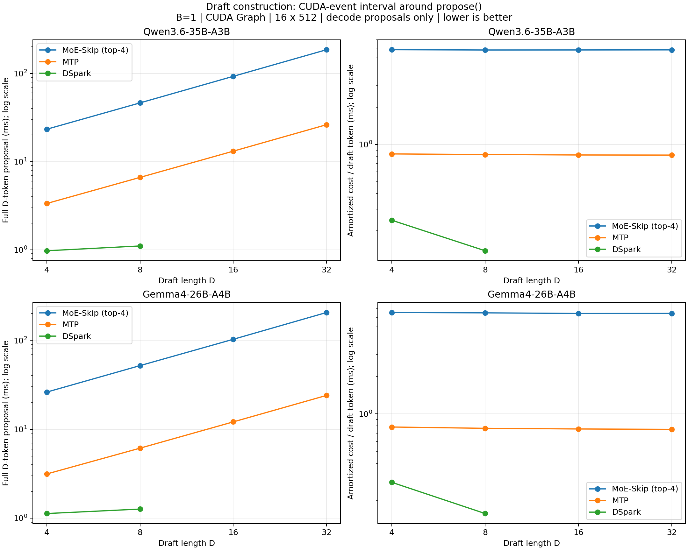

# MoE-Skip, MTP, and DSpark draft construction timing

Completed 2026-09-08. AI assistance was used for the benchmark extension, experiment, and report.



20/20 configurations completed: two models, MoE-Skip and MTP D=4/8/16/32, DSpark D=4/8. Each configuration uses 16 fixed prompts and 512 output tokens per prompt, B=1, TP=1, greedy decoding and CUDA Graph. Qwen3.6 uses A100 80GB GPU 1, Gemma4 uses GPU 0; the model queues run concurrently.

## What is measured

- CUDA Events bracket one complete `speculator.propose()` call: input/state preparation, all draft model forwards, context KV preparation when needed, and sampling. The interval excludes Target verification, initialization, the full warmup request, and RPC result collection.
- Events are preallocated and initialized after model warmup. No synchronization occurs inside a measured proposal. Events are synchronized and collected once after each completed request. CPU submit time is recorded separately with perf_counter_ns.
- The GPU metric is elapsed time between events on the CUDA stream. It can include GPU idle gaps caused by CPU submission; it is not the sum of kernel durations. CPU submit time overlaps device execution and must not be added to the CUDA interval. Instrumentation overhead is not subtracted.
- Main plots show the call-weighted mean over decode proposals, excluding the first proposal after prompt prefill. Prefill proposal metrics, medians, P90, and CPU submit times are included in draft_timing.csv. Methods see their own generated prefixes and context-length distributions.
- The right panel divides full-block time by D. It is amortized cost per proposed token, not a measured standalone one-token forward. MoE-Skip and MTP use sequential drafting; DSpark uses parallel block drafting with context preparation and sampling included.
- Model/configuration, top-4 MoE-Skip vs top-8 Target, no prefix caching, no logprobs, and no draft-quality tracing match the earlier E2E matrix. This run changes only benchmark-side worker instrumentation. It does not change the model or runtime algorithm.
- These measurements quantify draft cost, not end-to-end speedup or model quality. Different methods have different acceptance lengths and Target verification counts.

## Decode proposal results

| Model | Method | D | Calls | Mean block ms | Median ms | P90 ms | Amortized ms/token | CPU submit ms |
| --- | --- | ---: | ---: | ---: | ---: | ---: | ---: | ---: |
| qwen36 | moe_skip | 4 | 1814 | 23.313 | 23.312 | 23.335 | 5.828 | 7.592 |
| qwen36 | moe_skip | 8 | 1127 | 46.378 | 46.377 | 46.411 | 5.797 | 13.667 |
| qwen36 | moe_skip | 16 | 769 | 92.825 | 92.824 | 92.874 | 5.802 | 21.578 |
| qwen36 | moe_skip | 32 | 547 | 185.937 | 185.899 | 186.039 | 5.811 | 30.951 |
| qwen36 | mtp | 4 | 2186 | 3.352 | 3.353 | 3.368 | 0.838 | 0.858 |
| qwen36 | mtp | 8 | 1726 | 6.627 | 6.630 | 6.663 | 0.828 | 1.070 |
| qwen36 | mtp | 16 | 1662 | 13.146 | 13.151 | 13.199 | 0.822 | 1.325 |
| qwen36 | mtp | 32 | 1561 | 26.242 | 26.244 | 26.316 | 0.820 | 1.422 |
| qwen36 | dspark | 4 | 2449 | 0.975 | 0.976 | 1.021 | 0.244 | 1.125 |
| qwen36 | dspark | 8 | 2017 | 1.106 | 1.103 | 1.153 | 0.138 | 1.261 |
| gemma4 | moe_skip | 4 | 1728 | 26.185 | 26.166 | 26.486 | 6.546 | 4.264 |
| gemma4 | moe_skip | 8 | 1001 | 52.008 | 51.967 | 52.610 | 6.501 | 7.170 |
| gemma4 | moe_skip | 16 | 578 | 102.896 | 102.779 | 104.123 | 6.431 | 13.534 |
| gemma4 | moe_skip | 32 | 350 | 206.025 | 205.803 | 208.518 | 6.438 | 23.099 |
| gemma4 | mtp | 4 | 1761 | 3.137 | 3.135 | 3.239 | 0.784 | 0.962 |
| gemma4 | mtp | 8 | 1079 | 6.124 | 6.119 | 6.273 | 0.766 | 1.105 |
| gemma4 | mtp | 16 | 689 | 12.101 | 12.088 | 12.353 | 0.756 | 1.047 |
| gemma4 | mtp | 32 | 504 | 24.032 | 24.003 | 24.484 | 0.751 | 1.386 |
| gemma4 | dspark | 4 | 2829 | 1.125 | 1.125 | 1.193 | 0.281 | 2.137 |
| gemma4 | dspark | 8 | 1810 | 1.263 | 1.266 | 1.335 | 0.158 | 2.469 |

## Validation and reproduction

The 320 requests generated 163,840 tokens. 153/320 complete sequences match the earlier uninstrumented run of the same method and D. This checks instrumentation against the same method; it does not establish equivalence to AR. All cells have one prefill proposal per request and positive decode proposal timings, and no post-warmup JIT warnings were found. Runtime source hashes match the earlier E2E source snapshot.

Output equivalence to the earlier uninstrumented process runs was not established: 167/320 sequences differ. No same-process instrumented/uninstrumented control was run, so this comparison does not isolate the source of divergence. Timing results describe each method's actual generated contexts.

Python syntax compilation and Ruff checks passed. Source/result hashes and per-cell output comparisons are in validation.json; request-level means are in request_summary.csv. proposal_timings.csv preserves every proposal, while local source run directories retain output token IDs, logs, configurations and completion markers.

```bash
.venv/bin/python benchmarks/moe_skip/run_draft_timing.py --model qwen36 --cuda-device 1 --run-dir benchmark_results/draft_timing_qwen36_new
.venv/bin/python benchmarks/moe_skip/run_draft_timing.py --model gemma4 --cuda-device 0 --run-dir benchmark_results/draft_timing_gemma4_new
```

The driver imports the existing run_performance.py model/dataset mapping. It prepends the benchmark directory to worker PYTHONPATH and loads draft_timing_worker.DraftTimingWorker. Run --summarize --run-dir PATH to regenerate plots and summary CSVs from a complete run.

The measured runtime includes the pre-existing local MoE-Skip changes. Only the benchmark extension, driver, and derived result artifacts are published by this change.

For repository API compliance, the published worker uses torch.accelerator.synchronize instead of torch.cuda.synchronize for initialization and post-request event collection. These calls are outside measured proposals. A two-GPU event-completion smoke passed; the full matrix was not rerun for this API-only change. draft_timing_worker_measured.txt preserves the exact measured extension, whose hash is recorded in validation.json.
