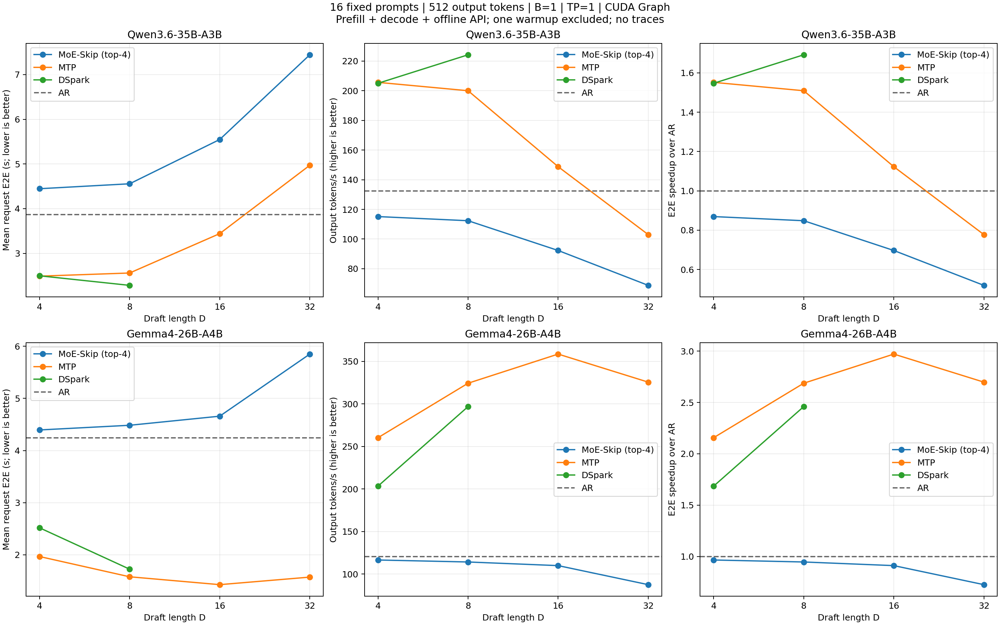

# MoE-Skip, MTP, and DSpark: measured B=1 end-to-end performance

Completed 2026-09-08 on the local vLLM checkout. AI assistance was used to implement the harness, run the matrix, and prepare this report.

22/22 configurations completed and audited: 352 timed requests and 180,224 output tokens. Each configuration uses the same 16 prompts (four each from HumanEval, Alpaca, GSM8K, and UltraFeedback), exactly 512 generated tokens per request, greedy decoding, TP=1, B=1, and CUDA Graph. Qwen3.6 runs on A100 80GB GPU 1; Gemma4 runs on A100 80GB GPU 0. The two model queues run concurrently.



## Measurement contract

- E2E is the wall time of each blocking local `llm.generate` call: input processing, prefill, decode, and result return. Total E2E is the sum of the 16 calls. Output throughput is 8,192 divided by total E2E. It excludes model loading, initialization, one full 512-token warmup request, inter-request JSON writes, and network transport.
- Raw text prompts, no chat template, seed 0, ignore_eos=true, no returned logprobs, no draft-quality traces, no per-request speculative metrics, prefix caching disabled. Context limit 1,024; max batched tokens 4,096; max sequences 1; GPU memory utilization 0.95.
- MoE-Skip uses the existing implementation with top-4 draft experts and top-8 target experts. Native scheduling defaults are retained; the current MoE-Skip gate disables async scheduling. This is a comparison of the current usable implementations.
- One timed pass per configuration. No repeated-run confidence intervals were measured; small differences must not be treated as stable wins.
- This is free generation with identical prompts and output lengths. Full greedy token sequences do not generally match AR; no token-exact equivalence or model-quality conclusion is claimed. Exact-match counts are included below and per-request common-prefix lengths are in request_metrics.csv.

## Results

| Model | Method | D | Total E2E (s) | Mean request (s) | Output token/s | Speedup / AR | Exact AR requests / 16 |
| --- | --- | ---: | ---: | ---: | ---: | ---: | ---: |
| qwen36 | ar | 0 | 61.826 | 3.864 | 132.50 | 1.000 | 16 |
| qwen36 | moe_skip | 4 | 71.144 | 4.447 | 115.15 | 0.869 | 1 |
| qwen36 | moe_skip | 8 | 72.910 | 4.557 | 112.36 | 0.848 | 2 |
| qwen36 | moe_skip | 16 | 88.760 | 5.547 | 92.29 | 0.697 | 2 |
| qwen36 | moe_skip | 32 | 119.089 | 7.443 | 68.79 | 0.519 | 1 |
| qwen36 | mtp | 4 | 39.844 | 2.490 | 205.60 | 1.552 | 1 |
| qwen36 | mtp | 8 | 40.968 | 2.560 | 199.96 | 1.509 | 2 |
| qwen36 | mtp | 16 | 55.067 | 3.442 | 148.76 | 1.123 | 2 |
| qwen36 | mtp | 32 | 79.532 | 4.971 | 103.00 | 0.777 | 1 |
| qwen36 | dspark | 4 | 39.966 | 2.498 | 204.97 | 1.547 | 1 |
| qwen36 | dspark | 8 | 36.542 | 2.284 | 224.18 | 1.692 | 2 |
| gemma4 | ar | 0 | 67.892 | 4.243 | 120.66 | 1.000 | 16 |
| gemma4 | moe_skip | 4 | 70.320 | 4.395 | 116.50 | 0.965 | 1 |
| gemma4 | moe_skip | 8 | 71.756 | 4.485 | 114.16 | 0.946 | 2 |
| gemma4 | moe_skip | 16 | 74.545 | 4.659 | 109.89 | 0.911 | 2 |
| gemma4 | moe_skip | 32 | 93.602 | 5.850 | 87.52 | 0.725 | 3 |
| gemma4 | mtp | 4 | 31.480 | 1.968 | 260.23 | 2.157 | 0 |
| gemma4 | mtp | 8 | 25.265 | 1.579 | 324.25 | 2.687 | 2 |
| gemma4 | mtp | 16 | 22.850 | 1.428 | 358.51 | 2.971 | 2 |
| gemma4 | mtp | 32 | 25.165 | 1.573 | 325.53 | 2.698 | 2 |
| gemma4 | dspark | 4 | 40.292 | 2.518 | 203.32 | 1.685 | 0 |
| gemma4 | dspark | 8 | 27.601 | 1.725 | 296.80 | 2.460 | 0 |

## Reproduce and source evidence

Harness: `benchmarks/moe_skip/run_performance.py`. Run one process per model:

```bash
.venv/bin/python benchmarks/moe_skip/run_performance.py --models qwen36 --cuda-device 1 --run-dir benchmark_results/qwen36_perf_new
.venv/bin/python benchmarks/moe_skip/run_performance.py --models gemma4 --cuda-device 0 --run-dir benchmark_results/gemma4_perf_new
```

The harness uses the local checkpoint and previous dataset paths recorded in its MODELS mapping. The first 16 rows of the previous interleaved 128-prompt manifests supply the four samples per category. `--resume` skips completed cells after validation; `--summarize` regenerates plots and the audit from a complete run.

Validation: Ruff check and format check passed; Python syntax compilation passed. Both 11-cell GPU matrices completed, every result has 16 outputs of 512 tokens, ordered prompt hashes match across methods and models, timing sums and dataset hashes passed the final audit.

Measured runtime is base commit `21a2211040` plus the existing local MoE-Skip modifications. This benchmark change does not commit or alter those pre-existing runtime modifications. Local runtime source snapshot and hashes: `benchmark_results/moe_skip_e2e_16x512_b1_20260908_sources/`. Raw per-cell logs, configurations, output token IDs, and completion markers are in the source runs listed in contract.json.

The initial attempt failed before measurement because `.venv/bin` was missing from child PATH (ninja not found). Its logs are preserved in `benchmark_results/moe_skip_e2e_16x512_b1_20260908/`; no failed-attempt timings enter this report.
