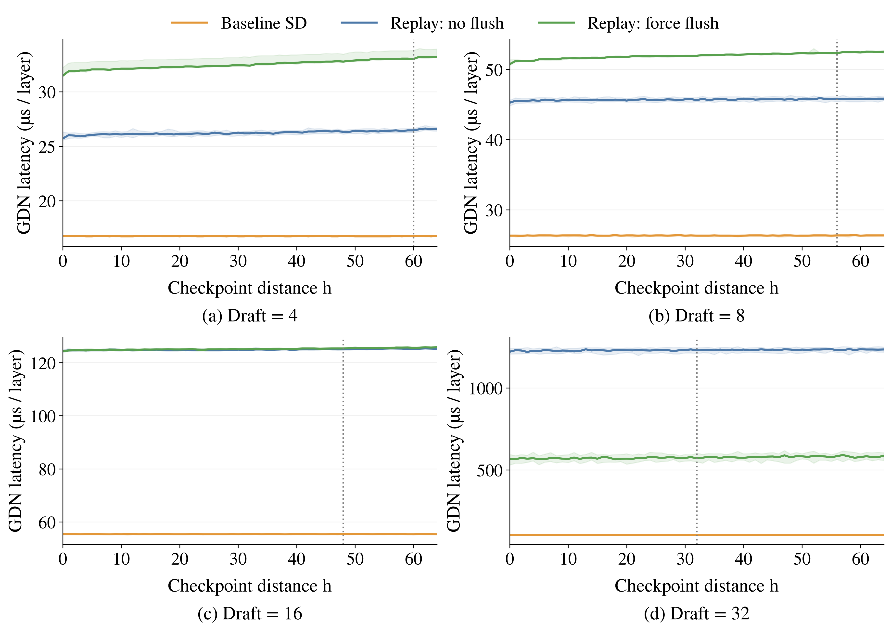
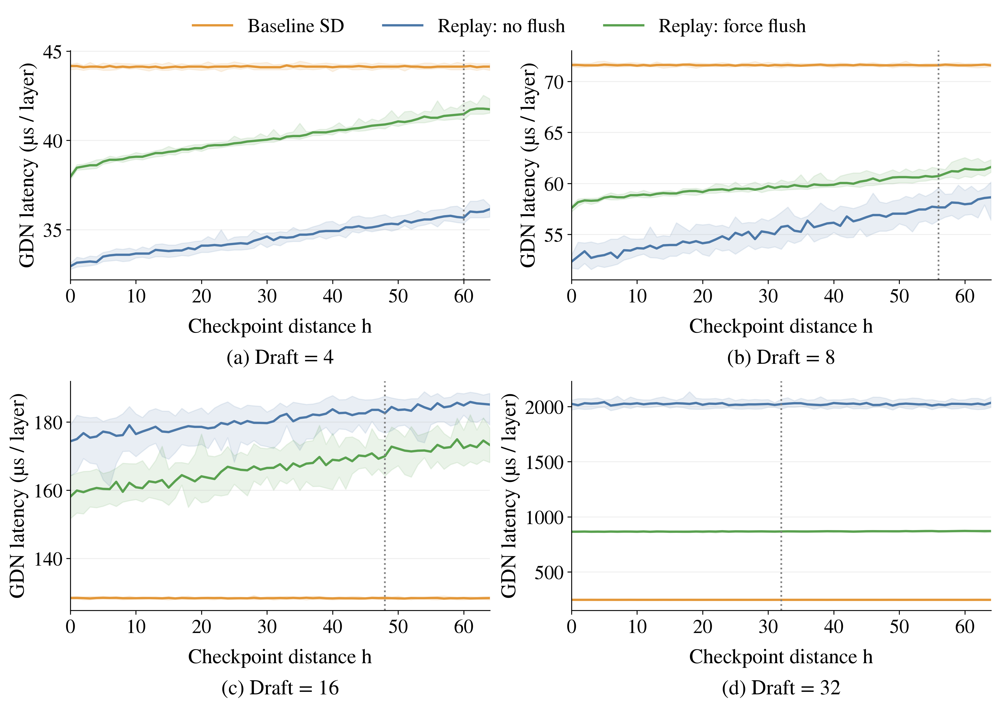
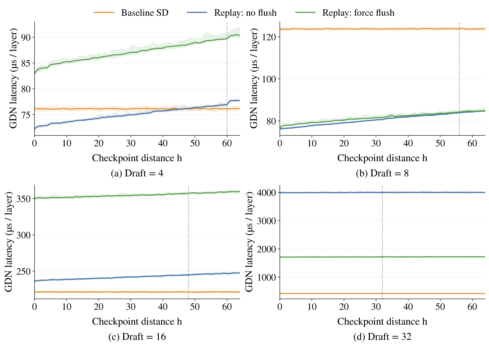
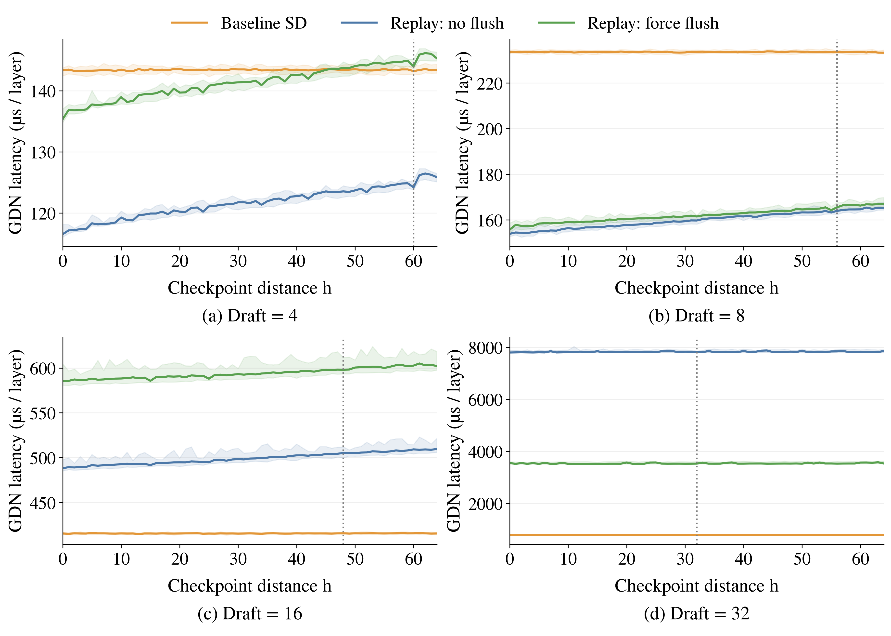

# Qwen3.6 / A100：历史距离扫描结果

第一阶段已完成；用户要求暂停后续阈值选择和端到端实验。

共 16 个 B/D 组合 × 65 个历史距离 × 2 种工作集 = 2,080 个点。每点比较 baseline SD、ReplaySSM 非 flush、ReplaySSM 强制 flush，各 21 轮，共 131,040 个正式计时值。所有点的两条 ReplaySSM 路径均通过对 baseline 输出的数值检查，rtol=0.04、atol=0.01。

B=1/4/8/16；D=4/8/16/32，实际验证宽度 T=D+1。Qwen GDN 维度为 HQ=16、HV=32、K=V=128；输入 BF16，checkpoint FP32，d/k ring FP16、g ring FP32。物理 ring=128，历史计算 tile=64。每个点使用相互对应的 checkpoint、历史和当前位置 state。

主图使用 30 个独立 GDN 层 buffer 轮换，计时除以 30；同时保存单层工作集数据。它们都是合成输入的 GDN 核心 kernel 测量，不包含投影、Conv、普通 Attention、MoE 或整模型调度。重置、编译、预热和用于排除 CPU 提交间隙的 GPU prelude 均不计时。

## 30 层轮换结果

下表单位为 µs/层；h=0 与 h=64 均为 21 轮中位数。

| B | D | SD h=0 | 非 flush h=0 | 非 flush h=64 | flush h=0 | flush h=64 | 中位数关系 |
| ---: | ---: | ---: | ---: | ---: | ---: | ---: | --- |
| 1 | 4 | 16.76 | 25.70 | 26.59 | 31.47 | 33.18 | 全区间慢于 SD |
| 1 | 8 | 26.32 | 45.26 | 45.84 | 50.76 | 52.53 | 全区间慢于 SD |
| 1 | 16 | 55.36 | 124.35 | 125.24 | 124.38 | 125.82 | 全区间慢于 SD |
| 1 | 32 | 103.42 | 1220.13 | 1233.85 | 565.28 | 585.83 | 全区间慢于 SD |
| 4 | 4 | 44.17 | 32.94 | 36.15 | 37.96 | 41.75 | 全区间快于 SD |
| 4 | 8 | 71.61 | 52.33 | 58.64 | 57.58 | 61.61 | 全区间快于 SD |
| 4 | 16 | 128.38 | 174.32 | 185.11 | 158.07 | 173.23 | 全区间慢于 SD |
| 4 | 32 | 246.58 | 2024.82 | 2034.24 | 864.56 | 870.54 | 全区间慢于 SD |
| 8 | 4 | 76.12 | 72.23 | 77.72 | 82.98 | 90.32 | 约 h=47 起连续三点慢于 SD |
| 8 | 8 | 123.80 | 76.08 | 84.58 | 76.70 | 84.86 | 全区间快于 SD |
| 8 | 16 | 220.81 | 236.03 | 247.23 | 350.11 | 359.66 | 全区间慢于 SD |
| 8 | 32 | 417.18 | 3987.52 | 3994.79 | 1706.26 | 1714.86 | 全区间慢于 SD |
| 16 | 4 | 143.36 | 116.53 | 125.85 | 135.37 | 145.31 | 全区间快于 SD |
| 16 | 8 | 233.44 | 153.91 | 165.34 | 155.75 | 167.08 | 全区间快于 SD |
| 16 | 16 | 415.57 | 488.28 | 509.68 | 585.42 | 602.28 | 全区间慢于 SD |
| 16 | 32 | 783.12 | 7798.24 | 7856.30 | 3551.33 | 3529.80 | 全区间慢于 SD |

## 图与交点解释

30 层轮换下，10 组非 flush 从 h=0 起即慢于 SD，5 组全区间快于 SD。仅 B=8、D=4 在 h≈47 出现连续三点的中位数交叉；它未达到下述稳定变慢判据。没有观察到通用的 h=8 拐点。单层结果有所不同，例如 B=4、D=8 的稳定变慢点为 h=45；不能将一种工作集下的交点直接推广到另一种工作集。

D=32 时，强制 flush 在 h=0 就比非 flush 更快。历史 tile 固定为 64，h 的变化不会缩小矩阵计算的 tile 维度。这些结果提示编译分支和固定计算成本也有影响，不能把大 D 的性能问题全部归因于 checkpoint 距离。

曲线阴影为 min/max，不是置信区间。JSON 另给出配对 bootstrap 95% 区间：只有 Replay/SD 的区间下界 >1.02 且连续三点满足，才记为稳定变慢点。h=0 已经较慢的配置不应解释为存在正距离拐点。

默认策略在 h≥64-D 时触发 flush；主图虚线标记该位置。线右侧的非 flush 曲线是受控反事实，不表示运行时关闭了溢出保护。

直接读取 state 的 baseline 参考线不计此前物化该 state 的成本。当前步强制 flush 的延迟也不能单独决定长期最优刷新周期。因此本阶段不输出最优 interval 或新的端到端加速结论。

### B=1



[PDF](flush_distance_b1/flush_distance_b1.pdf)

### B=4



[PDF](flush_distance_b4/flush_distance_b4.pdf)

### B=8



[PDF](flush_distance_b8/flush_distance_b8.pdf)

### B=16



[PDF](flush_distance_b16/flush_distance_b16.pdf)

## 资源与验证记录

Nsight Compute 直接探测返回 ERR_NVGPUCTRPERM；未采集硬件 DRAM/L2 计数器，也未修改驱动权限。resources/ 保存 CUDA 函数属性：寄存器数、每线程 local-memory 分配及 shared memory。它们不是实际 IO 字节数。

21 项随机回滚/提前 flush 检查、5 项配置检查通过；新增请求重用 reset 检查另行通过。后续模型校准数据和阈值估算不纳入本阶段的结果与完成判定。

kernel 原始数据见 kernels/distance_*.json；汇总见 stage1_summary.csv 与 distance_summary.csv；测量命令及冻结源码见 jobs/distance_*/launch.json 与 source/。

重新汇总及绘图：

```bash
.venv/bin/python benchmarks/replayssm/analyze_qwen36_flush_study.py \
  --output benchmark_results/qwen36_a100_flush_crossover_20260914 --mode stage1
.venv/bin/python benchmarks/replayssm/analyze_qwen36_flush_study.py \
  --output benchmark_results/qwen36_a100_flush_crossover_20260914 --mode figures
```

代码与报告使用 AI 辅助生成。本次未创建上游 PR。
