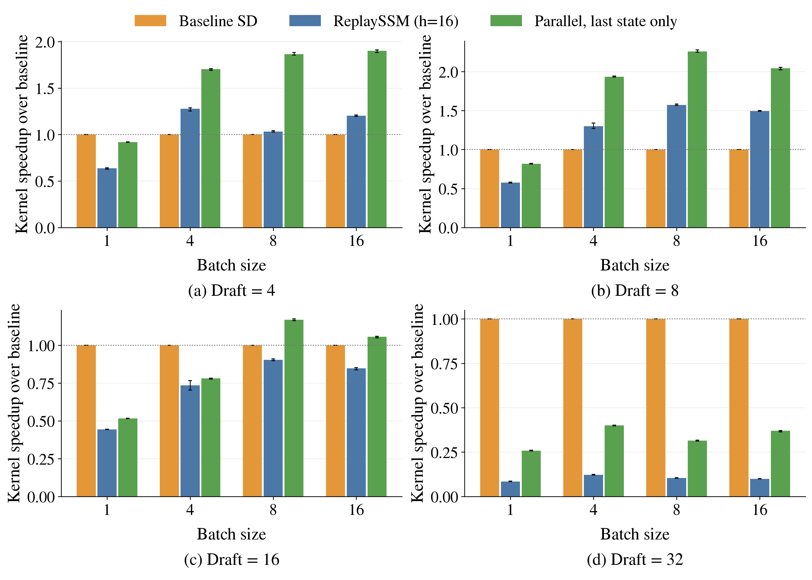
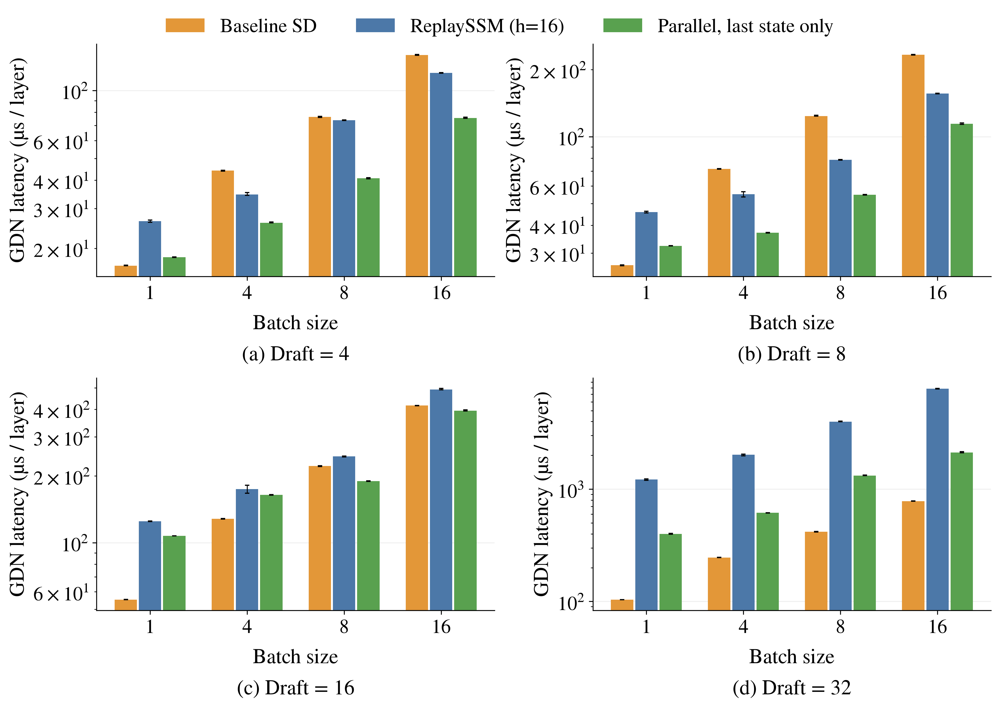

# Qwen3.6 A100: three GDN methods at h=16

User-requested fixed-distance rerun. All 16 batch/draft combinations complete. Both single-layer and 30-layer working sets were freshly measured; 21 rounds per method. All output checks and parallel-last final-state checks passed (rtol=0.04, atol=0.01).

## Methods

- Baseline SD: read the current state, recurrent verification, write all candidate states.
- ReplaySSM: read a checkpoint 16 committed positions earlier plus history, parallel verification, write d/k/g. No flush.
- Parallel-last: read the same current state as baseline, use the ReplaySSM within-window solve, write only the final candidate state. No d/k/g ring writes.

The benchmark-only parallel-last kernel retains the existing solve and verify launch configuration. Final state is formed from the solved deltas and normalized keys. Small windows pad only the final-state dot to a reduction width of 16. The final-state epilogue reloads starting-state tiles and keys; actual read traffic is not asserted to equal one full-state read. It has one kernel launch; the unmodified ReplaySSM wrapper has two launches with device-side routing.

## Configuration and limits

Actual checkpoint distance h=16 is fixed by the user. R=64, physical ring=128, history tile=64 are retained from the previous study. The source default R=16 is not being used. T=D+1. HQ=16, HV=32, K=V=128. The input checkpoint is read-only for parallel-last; the final state is written to a separate scratch buffer. A canary checks that the unused slot stays untouched. No intermediate full-state tensor is allocated by the new kernel.

Each repetition restores inputs outside timing. Each point uses identical current state and verification inputs across methods. CUDA graphs exclude Python dispatch, reset and warmup. A GPU prelude excludes CPU submission gaps. Only GDN core computation is measured: no projection, convolution, full attention, MoE, acceptance, prefill or end-to-end execution. One seed (0); min/max error bars describe these 21 rounds, not cross-input uncertainty. Source snapshots and per-cell launch commands accompany the raw results.

## Thirty-layer results

| Batch | Draft | Baseline µs | Replay µs | Parallel-last µs | Replay speedup | Parallel-last speedup |
| ---: | ---: | ---: | ---: | ---: | ---: | ---: |
| 1 | 4 | 16.76 | 26.35 | 18.26 | 0.636 | 0.918 |
| 1 | 8 | 26.42 | 45.84 | 32.29 | 0.576 | 0.818 |
| 1 | 16 | 55.36 | 124.93 | 107.35 | 0.443 | 0.516 |
| 1 | 32 | 103.56 | 1221.32 | 400.25 | 0.085 | 0.259 |
| 4 | 4 | 44.20 | 34.61 | 25.94 | 1.277 | 1.704 |
| 4 | 8 | 71.68 | 55.09 | 37.03 | 1.301 | 1.935 |
| 4 | 16 | 128.14 | 174.28 | 164.22 | 0.735 | 0.780 |
| 4 | 32 | 246.37 | 2025.03 | 615.77 | 0.122 | 0.400 |
| 8 | 4 | 76.22 | 73.80 | 40.86 | 1.033 | 1.865 |
| 8 | 8 | 123.80 | 78.75 | 54.82 | 1.572 | 2.258 |
| 8 | 16 | 221.49 | 244.94 | 189.54 | 0.904 | 1.169 |
| 8 | 32 | 416.80 | 3994.93 | 1323.69 | 0.104 | 0.315 |
| 16 | 4 | 143.63 | 119.47 | 75.57 | 1.202 | 1.901 |
| 16 | 8 | 233.61 | 156.19 | 114.35 | 1.496 | 2.043 |
| 16 | 16 | 415.88 | 490.43 | 393.73 | 0.848 | 1.056 |
| 16 | 32 | 781.86 | 7837.53 | 2114.80 | 0.100 | 0.370 |

## Figures



[Speedup PDF](h16_speedup/h16_speedup.pdf)



[Latency PDF](h16_latency/h16_latency.pdf)

## Reproduce

```bash
.venv/bin/python benchmarks/replayssm/qwen36_fixed_history.py --queue --gpu 0 --output benchmark_results/qwen36_a100_h16_three_methods_20260914
.venv/bin/python benchmarks/replayssm/qwen36_fixed_history.py --queue --gpu 1 --output benchmark_results/qwen36_a100_h16_three_methods_20260914
.venv/bin/python benchmarks/replayssm/plot_qwen36_fixed_history.py --output benchmark_results/qwen36_a100_h16_three_methods_20260914
```

Code and report prepared with AI assistance; no upstream PR.
