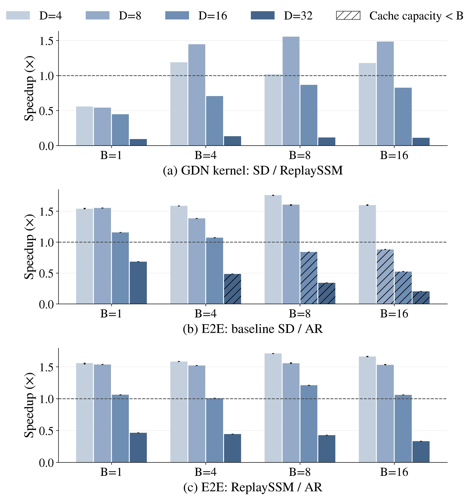

# Qwen3.6 单 A100：AR / baseline SD / ReplaySSM

已完成 36/36 个配置的计时和 CUDA profile。

完整矩阵为 4 个 AR 对照、16 个 baseline SD、16 个 ReplaySSM；同一 B 的四个草稿长度共用该 B 的 AR 对照。

模型为本地 Qwen3.6-35B-A3B，BF16 权重/激活、FP32 SSM state。每组单卡 A100 80GB PCIe，TP=1，EP 关闭；两卡分别跑不同配置。B 为每次提交的请求数及 max_num_seqs；实际执行 batch 由调度器决定。GSM8K test 前 16 条，greedy，thinking 关闭、ignore_eos=True，每条严格输出 128 tokens。原生 MTP 草稿长度 D=4/8/16/32；验证宽度 D+1。ReplaySSM history block 固定 64。CUDA Graph 开启，prefix cache 关闭，max_model_len=1024，KV cache 固定 7 GiB，显式 cache 预算覆盖 gpu_memory_utilization 设置。

端到端吞吐为 2048 / 16 条请求的总执行秒数，含 prefill、draft、verify、调度及输出处理，不含模型加载、预热或 profiler。表中为三轮中位数；图中误差线为三轮 min/max，不是置信区间。各 batch 的 AR 对照位于同一张物理 GPU。先预热两轮完整数据；计时轮若有 worker JIT 事件则归档为额外预热，补足三轮无 JIT 测量。

summary 的 accepted_length 为引擎计数器的 1 + accepted_draft_tokens / draft_rounds，三轮取平均；它不是最终截断后每轮实际输出 token 数。吞吐始终按实际返回的 16×128 tokens 除以执行耗时计算。

注意：带 * 的 SD 配置，其引擎报告的 1024-token 请求缓存并发容量小于请求 B；这不是实际短请求并发数的直接测量。实际准入还应结合 summary 中的 Running/Waiting 日志采样值判断，端到端结果包含引擎实际调度行为，缓存不足点不是固定实际 batch=B 的对照。主图与下表的 kernel speedup 使用另行测量的固定 B 单层 kernel：真实 Qwen GDN 维度、合成输入、每步固定提交 4 tokens，包含 ReplaySSM verify/flush 和 cursor commit，不含 Conv、投影、MoE。单层 CUDA Graph 重复使用同一组 buffers，缓存局部性与完整模型不同。补充 kernel latency 图使用完整模型的独立 profile，它会受准入限制及自然结束降批影响。两种 kernel 口径分别保存。

已完成配置中，0/36 个配置的三轮输出不完全一致；已完成的跨方法对照中，32/32 组存在逐 token 差异。有输出差异的对照只能解释为当前运行条件下的实测性能，不能作为严格输出等价下的纯 kernel 因果加速结论。详细分歧与重复稳定性见 output_consistency.json。

| B | D | AR tok/s | SD tok/s | Replay tok/s | SD/AR | Replay/AR | Replay/SD | Kernel SD/Replay |
| ---: | ---: | ---: | ---: | ---: | ---: | ---: | ---: | ---: |
| 1 | 4 | 131.19 | 201.80 | 204.29 | 1.538× | 1.557× | 1.012× | 0.557× |
| 1 | 8 | 131.19 | 203.51 | 201.57 | 1.551× | 1.536× | 0.990× | 0.541× |
| 1 | 16 | 131.19 | 151.73 | 139.19 | 1.157× | 1.061× | 0.917× | 0.447× |
| 1 | 32 | 131.19 | 89.70 | 60.93 | 0.684× | 0.464× | 0.679× | 0.092× |
| 4 | 4 | 322.30 | 510.85 | 510.43 | 1.585× | 1.584× | 0.999× | 1.189× |
| 4 | 8 | 322.30 | 445.34 | 490.07 | 1.382× | 1.521× | 1.100× | 1.445× |
| 4 | 16 | 322.30 | 345.13 | 324.66 | 1.071× | 1.007× | 0.941× | 0.707× |
| 4 | 32 | 322.30 | 156.09* | 142.89 | 0.484× | 0.443× | 0.915× | 0.133× |
| 8 | 4 | 459.48 | 807.38 | 784.97 | 1.757× | 1.708× | 0.972× | 1.014× |
| 8 | 8 | 459.48 | 737.50 | 714.90 | 1.605× | 1.556× | 0.969× | 1.554× |
| 8 | 16 | 459.48 | 385.34* | 555.76 | 0.839× | 1.210× | 1.442× | 0.867× |
| 8 | 32 | 459.48 | 156.59* | 196.24 | 0.341× | 0.427× | 1.253× | 0.114× |
| 16 | 4 | 800.22 | 1278.44 | 1329.84 | 1.598× | 1.662× | 1.040× | 1.178× |
| 16 | 8 | 800.22 | 703.80* | 1225.74 | 0.880× | 1.532× | 1.742× | 1.484× |
| 16 | 16 | 800.22 | 418.21* | 848.06 | 0.523× | 1.060× | 2.028× | 0.826× |
| 16 | 32 | 800.22 | 163.22* | 266.22 | 0.204× | 0.333× | 1.631× | 0.110× |

## 图



[主图 PDF](qwen36_a100_figure7/qwen36_a100_figure7.pdf)

- 绝对吞吐：[PNG](qwen36_a100_throughput/qwen36_a100_throughput.png) / [PDF](qwen36_a100_throughput/qwen36_a100_throughput.pdf)
- 整模型 profile 中的 GDN 延迟：[PNG](qwen36_a100_kernel_latency/qwen36_a100_kernel_latency.png) / [PDF](qwen36_a100_kernel_latency/qwen36_a100_kernel_latency.pdf)

## 运行稳定性

| 配置 | 三轮输出完全一致 | 吞吐 min–max (tok/s) | 缓存并发上限 |
| --- | --- | ---: | ---: |
| B=1, D=0, ar | True | 131.17–131.24 | 86.75 |
| B=1, D=4, standard | True | 201.64–202.97 | 19.12 |
| B=1, D=4, replayssm | True | 202.46–204.32 | 44.75 |
| B=1, D=8, standard | True | 203.19–203.61 | 10.61 |
| B=1, D=8, replayssm | True | 201.50–201.76 | 44.0 |
| B=1, D=16, standard | True | 151.47–151.75 | 5.4 |
| B=1, D=16, replayssm | True | 139.06–139.20 | 42.5 |
| B=1, D=32, standard | True | 89.66–89.70 | 2.54 |
| B=1, D=32, replayssm | True | 60.93–60.95 | 40.0 |
| B=4, D=0, ar | True | 322.11–322.36 | 86.75 |
| B=4, D=4, standard | True | 509.66–510.87 | 19.12 |
| B=4, D=4, replayssm | True | 510.35–510.67 | 44.75 |
| B=4, D=8, standard | True | 444.59–445.51 | 10.61 |
| B=4, D=8, replayssm | True | 489.15–490.25 | 44.0 |
| B=4, D=16, standard | True | 344.36–345.31 | 5.4 |
| B=4, D=16, replayssm | True | 324.38–324.72 | 42.5 |
| B=4, D=32, standard | True | 156.06–156.22 | 2.54 |
| B=4, D=32, replayssm | True | 142.87–142.90 | 40.0 |
| B=8, D=0, ar | True | 458.69–460.38 | 86.75 |
| B=8, D=4, standard | True | 804.97–808.28 | 19.12 |
| B=8, D=4, replayssm | True | 784.36–785.43 | 44.75 |
| B=8, D=8, standard | True | 731.85–737.96 | 10.61 |
| B=8, D=8, replayssm | True | 713.87–717.76 | 44.0 |
| B=8, D=16, standard | True | 385.08–385.61 | 5.4 |
| B=8, D=16, replayssm | True | 555.08–555.84 | 42.5 |
| B=8, D=32, standard | True | 156.39–156.83 | 2.54 |
| B=8, D=32, replayssm | True | 195.99–196.26 | 40.0 |
| B=16, D=0, ar | True | 794.93–800.39 | 86.75 |
| B=16, D=4, standard | True | 1274.99–1281.59 | 19.12 |
| B=16, D=4, replayssm | True | 1325.29–1331.27 | 44.75 |
| B=16, D=8, standard | True | 703.05–705.30 | 10.61 |
| B=16, D=8, replayssm | True | 1225.38–1230.02 | 44.0 |
| B=16, D=16, standard | True | 417.81–418.91 | 5.4 |
| B=16, D=16, replayssm | True | 847.71–848.31 | 42.5 |
| B=16, D=32, standard | True | 163.12–163.34 | 2.54 |
| B=16, D=32, replayssm | True | 266.08–266.48 | 40.0 |

## 文件与复现

- contract.json：环境、模型/数据指纹与实验口径。
- model_weights_sha256.json：26 个权重分片的完整 SHA-256；environment.json 记录 GPU、驱动、Python 与拓扑。
- source/：实际测量源码的逐字副本，使用 .py.txt 后缀保留原始内容；逐字复现时在独立目录恢复 .py 文件名，从仓库根目录运行，CLI 参数与下方命令相同。
- summary.csv / summary.json：完整标量结果。
- controlled_kernels.csv / controlled_kernels.json：固定 B 单层 kernel 实测及七轮 min/max；主图 kernel speedup 的数据来源。
- b*_d*_*：每个配置的参数、命令、日志、逐轮 token 与原始 profile。
- kernel_correctness.json：真实 Qwen GDN 维度的四种 D 数值检查；每种含两个单步历史位置和 80 步随机接受/回滚检查。
- 图目录各含同名 PNG、PDF、Markdown。

以下在相同源码提交、模型和运行环境下新建复测目录。两条模型矩阵命令可在独立终端并行；kernel 测量须等模型进程退出。

```bash
result_root=/home/fanya/vllm-replayssm-pr47576/benchmark_results/qwen36_a100_replayssm_16x128_fixedkv_20260914
run_root=/home/fanya/vllm-replayssm-pr47576/benchmark_results/qwen36_a100_replayssm_16x128_fixedkv_20260914_rerun
frozen_dir=/tmp/qwen36_a100_measured
mkdir -p "$frozen_dir" "$run_root/source"
cp "$result_root/contract.json" "$run_root/contract.json"
cp "$result_root/model_weights_sha256.json" "$run_root/"
cp "$result_root/environment.json" "$run_root/"
cp "$result_root"/source/*.py.txt "$run_root/source/"
for name in qwen36_a100_matrix qwen36_replayssm_gate qwen36_gdn_kernel_matrix; do
  cp "$result_root/source/$name.py.txt" "$frozen_dir/$name.py"
done
.venv/bin/python "$frozen_dir/qwen36_a100_matrix.py" --output "$run_root" --gpu 0 --batches 1,4
.venv/bin/python "$frozen_dir/qwen36_a100_matrix.py" --output "$run_root" --gpu 1 --batches 8,16
CUDA_VISIBLE_DEVICES=1 .venv/bin/python "$frozen_dir/qwen36_gdn_kernel_matrix.py" --output "$run_root"
.venv/bin/python benchmarks/replayssm/analyze_qwen36_a100_matrix.py "$run_root"
```

展示参考 [ReplaySSM Figure 7](https://dao-lab.ai/blog/2026/replayssm/)。原图扫 buffer 容量；本实验按用户指定扫草稿长度，二者含义不同。

实验和分析脚本使用了 AI 辅助。
