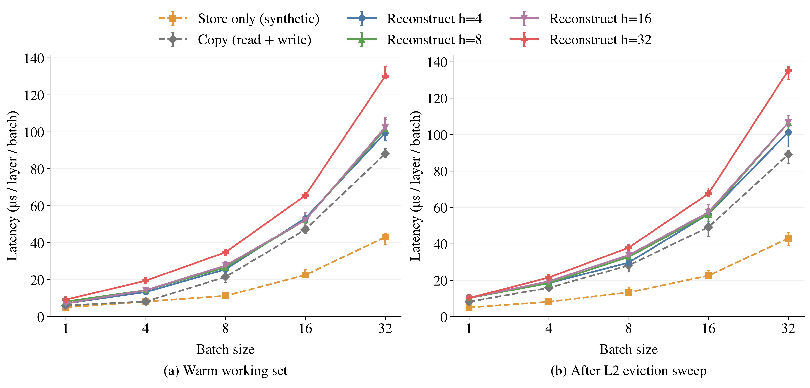

# SSM State 写回与重建的小样本比较

20 个 batch/h 组合，2 种缓存条件，3 种操作，每项 7 轮，共 840 个计时值；测量与数值检查均完成。

Qwen3.6 GDN 维度；单张 A100 80GB；单层，每个请求的 State 为 32×128×128 FP32，即 2 MiB。横轴为 batch size，纵轴为整个 batch 处理一层的耗时，不是每个请求的耗时。

Store only：由寄存器中的简单整数运算生成非零 FP32 模式并写入 State 大小的 buffer，不读取源 State。它是纯 store 成本的近似，包含生成模式的 少量计算和 kernel 启动成本，不是实际模型 flush kernel。

Copy：读取已经物化的当前 State，写入另一个 buffer，包含完整的读和写。

Reconstruct：读取 h 个位置之前的 checkpoint 和 h 条 d/k/g 历史更新，重建并写出当前完整 State。计时包含 checkpoint/历史读取、重建计算和结果写入；不包含投影、草稿验证、历史生成、接受/拒绝和端到端调度。

所有 h 固定同一个当前位置 32，分别从位置 32-h 的 checkpoint 开始。State FP32，d/k 缓存 FP16，g FP32。矩阵乘使用 TF32x3；历史 tile 为 max(16,next_pow2(h))，不是上一轮的固定 64 tile。

每个 batch/h/cache 组合 7 轮，随机交错三种方法；seed=0。重建曲线取 7 轮中位数；与 h 无关的 store/copy 合并四个 h 的共 28 轮。误差线为 min/max，不是置信区间。

每次测量前写入 256 MiB 无关 buffer，操作位于计时外。左图随后先执行 3 次待测 kernel，右图直接测量。清扫操作未通过硬件计数器验证 L2 命中率；热工作集也不保证大 batch 的全部数据能够驻留 L2。CUDA event 包围一次 CUDA graph 中的 kernel，预热、编译、输入构造不计时。

图中重建时间已经包含一次完整 State 写出，因此不能把它全部解释为纯算术成本，也不能把两条曲线相减当作严格隔离的重计算时间。

数据来源：../raw.json、../summary.csv。复现：

```bash
.venv/bin/python benchmarks/replayssm/plot_qwen36_state_cost.py --output benchmark_results/qwen36_a100_state_cost_20260915
```

## 耗时结果

单位为 µs，完整 batch、单个 GDN 层。

### warm

| Batch | State MiB | 仅写入 | 读＋写拷贝 | h=4 重建 | h=8 重建 | h=16 重建 | h=32 重建 |
| ---: | ---: | ---: | ---: | ---: | ---: | ---: | ---: |
| 1 | 2 | 5.12 | 6.14 | 7.17 | 8.19 | 7.17 | 9.22 |
| 4 | 8 | 8.19 | 8.19 | 13.31 | 14.34 | 14.34 | 19.46 |
| 8 | 16 | 11.26 | 21.50 | 25.60 | 26.62 | 27.65 | 34.82 |
| 16 | 32 | 22.53 | 47.10 | 53.25 | 52.22 | 52.22 | 65.54 |
| 32 | 64 | 43.01 | 88.06 | 99.33 | 101.38 | 102.40 | 130.05 |

### evicted

| Batch | State MiB | 仅写入 | 读＋写拷贝 | h=4 重建 | h=8 重建 | h=16 重建 | h=32 重建 |
| ---: | ---: | ---: | ---: | ---: | ---: | ---: | ---: |
| 1 | 2 | 5.12 | 8.19 | 10.24 | 10.24 | 10.24 | 10.24 |
| 4 | 8 | 8.19 | 15.87 | 18.43 | 18.43 | 19.46 | 21.50 |
| 8 | 16 | 13.31 | 28.16 | 29.70 | 32.77 | 33.79 | 37.89 |
| 16 | 32 | 22.53 | 49.15 | 56.32 | 56.32 | 57.34 | 67.58 |
| 32 | 64 | 43.01 | 89.09 | 101.38 | 106.50 | 106.50 | 135.17 |

## 数值检查与限制

重建输出同时对照原始逐步 FP32 GDN 递推结果 (rtol=0.02, atol=0.002)，以及根据实际缓存向量计算的独立 FP64 重建结果 (rtol=0.002, atol=0.0002)。全部通过。拷贝与原 State 逐元素完全一致；store 输出模式检查通过。

初始普通 TF32 版本在 FP64 对照中有一个元素超过门槛，失败记录保留在 initial_tf32_gate_failure/；正式结果全部采用 TF32x3 重新测量，没有放宽门槛，也没有混用初测耗时。这不是对生产 ReplaySSM 完整 flush 的测量。



[PDF](state_cost/state_cost.pdf)

代码与报告由 AI 辅助生成。本次没有上游 PR。
