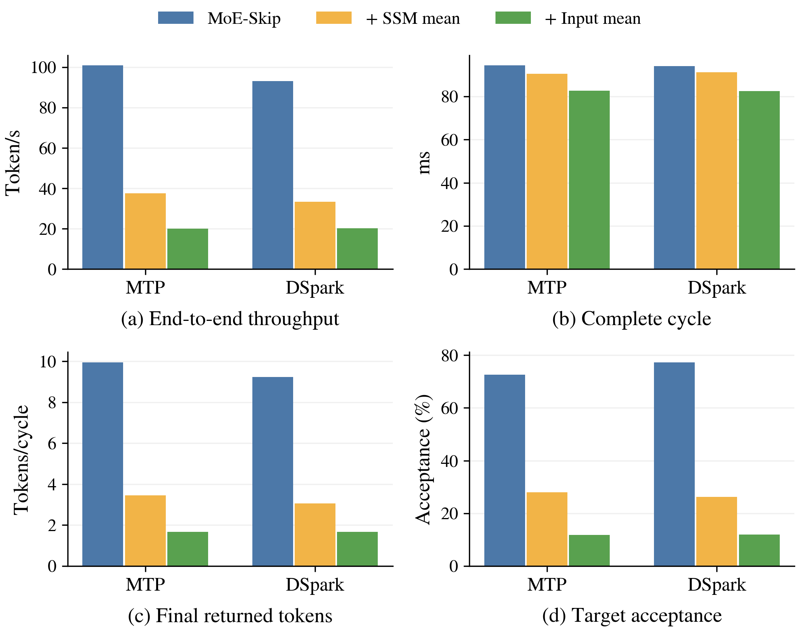
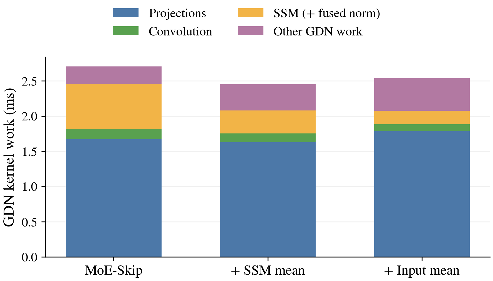

# Qwen3.6 GDN 均值 Pre-Verify：实现与实测

两种模式已接入现有共享权重 MoE-Skip Pre-Verify。当前实测均未获得端到端收益：少量前向和状态推进时间的节省，无法抵消最终 Target 接受率与每轮有效产出的下降。默认配置仍为 `preverify_gdn_mode="none"`。

## 测量范围与口径

Qwen3.6-35B-A3B，BF16，FP32 SSM，B=1、TP=1，内层 D=4/N=4，完整 Target top-8、Pre-Verify top-4。每个实际内层输入块包含 anchor 与 4 个候选，共 5 个位置。MTP 三组固定在 A100 80GB PCIe GPU 1，DSpark 三组固定在 GPU 0；仅在相同内层方法中比较模式。

六组 × 四条固定输入 × 三遍（无插桩、cycle profile、无插桩复测），共 72 个请求、18,432 个生成 token。每条请求固定生成 256 token，greedy、seed=0；四条输入均先预热。24/24 profile 请求、24/24 复测请求分别与首遍输出一致。正式计时后没有 JIT 警告或新增 Pre-Verify 图捕获。另有 4 条输入的两遍 AR 输出对照。

周期覆盖 proposal 到下一次 Target 验证/采样，排除附着于 prefill 的首轮以及没有随后验证的末尾 proposal。最后一轮的 returned token 数按输出上限裁剪，不把多采样但未返回的 token 记为吞吐收益。Target 接受率为 accepted/proposed，保留原始采样计数；它与 returned/cycle 口径不同。CPU 等待不与 CUDA-event 区间重复相加。

## 编译态端到端对照

吞吐为第二遍无插桩复测；首遍数据也保存在 summary.csv。以下均为四条输入的诊断性聚合，不包含置信区间或统计显著性声明。

| 内层 | GDN 模式 | 吞吐 token/s | 周期 ms | 返回 token/周期 | Target 接受率 | 内层接受率 |
| --- | --- | ---: | ---: | ---: | ---: | ---: |
| mtp | none | 100.94 | 94.36 | 9.959 | 72.59% | 55.74% |
| mtp | ssm_mean | 37.63 | 90.40 | 3.446 | 28.02% | 30.61% |
| mtp | input_mean | 20.09 | 82.67 | 1.672 | 11.76% | 10.81% |
| dspark | none | 93.21 | 94.04 | 9.243 | 77.32% | 43.75% |
| dspark | ssm_mean | 33.46 | 91.23 | 3.057 | 26.21% | 24.57% |
| dspark | input_mean | 20.23 | 82.45 | 1.677 | 12.00% | 10.31% |

MTP 周期内嵌套阶段如下。proposal 已包含内层 draft、metadata、Pre-Verify 和状态操作，不应把它们再次与 proposal 相加。stream 时间包含相应提交区间中的主机发射间隙，不能等同于纯 GPU kernel 工作量。

| MTP 阶段（ms/周期） | none | ssm_mean | input_mean |
| --- | ---: | ---: | ---: |
| proposal | 76.019 | 73.258 | 66.540 |
| state_begin | 5.102 | 4.960 | 4.975 |
| small_draft | 14.029 | 14.011 | 13.934 |
| preverify_metadata | 7.049 | 7.324 | 7.135 |
| preverify | 37.682 | 39.295 | 39.221 |
| preverify_graph_5 | 33.507 | 35.143 | 35.191 |
| state_advance | 10.912 | 6.362 | 0.046 |
| target_execute | 17.169 | 15.882 | 14.968 |
| target_sample | 0.708 | 0.690 | 0.677 |

## 相同输入和初始状态的前向诊断

额外固定三个前缀，对每个前缀的同一 5-token 块、同一初始私有 SSM/conv state，分别执行完整 top-8、原 top-4、ssm_mean top-4、input_mean top-4。每种情况分别记录 20 次无插桩和 20 次带事件回放，另排除 3 次预热回放；共 480 条正式记录。三个前缀的插桩/重复回放预测与控制一致。

这些是 **eager 路径捕获的 CUDA Graph 诊断**，用于同输入比较，不是上表编译态端到端运行的分解。所有模式均通过同一 GDN runtime dispatcher。无插桩总前向包含 backbone、LM head、argmax，不包含状态恢复、metadata 或候选生成。

| 固定输入前向 | 无插桩均值 ms |
| --- | ---: |
| input_mean / top-4 | 10.202 |
| none / top-4 | 10.578 |
| none / top-8 | 13.562 |
| ssm_mean / top-4 | 10.220 |

逐层 CUDA Event 会改变时间，因此不使用 stages.csv 的插桩占比作为主要 kernel 证据。kernel trace 在全部计时结束后采集，来自第三个固定前缀；通过带注释 eager 调用与不含逐层 Event 的图回放逐一匹配 kernel 名称与顺序。30 次 DtoD copy 在图中表现为 memcpy32_post，映射时显式检查 memcpy 类型和字节数。原始 trace 和逐 kernel 映射均保留。

以下为该图从首个 kernel 到最后一个 kernel 的 GPU 时间线分区（ms / %），共享专家与 routed/router 的重叠单列，不重复计算。它包含无 kernel 的间隙，且仍属 eager 诊断；尤其不能将此处 norm 占比外推到已编译运行。

| 阶段 | 完整 top-8 | 原 top-4 | ssm_mean | input_mean |
| --- | ---: | ---: | ---: | ---: |
| attention | 0.664 / 4.7% | 0.670 / 6.1% | 0.667 / 6.3% | 0.665 / 6.3% |
| gdn | 2.703 / 19.3% | 2.694 / 24.5% | 2.448 / 23.1% | 2.528 / 23.9% |
| routed | 5.011 / 35.7% | 2.511 / 22.8% | 2.345 / 22.1% | 2.317 / 21.9% |
| routing | 0.005 / 0.0% | 0.005 / 0.0% | 0.005 / 0.0% | 0.005 / 0.0% |
| shared | 0.294 / 2.1% | 0.234 / 2.1% | 0.222 / 2.1% | 0.217 / 2.1% |
| shared_overlap | 1.899 / 13.5% | 1.439 / 13.1% | 1.446 / 13.7% | 1.417 / 13.4% |
| moe_other | 0.078 / 0.6% | 0.076 / 0.7% | 0.075 / 0.7% | 0.075 / 0.7% |
| norm | 2.662 / 19.0% | 2.665 / 24.2% | 2.667 / 25.2% | 2.639 / 24.9% |
| lm_head | 0.614 / 4.4% | 0.608 / 5.5% | 0.610 / 5.8% | 0.609 / 5.8% |
| embedding | 0.009 / 0.1% | 0.009 / 0.1% | 0.008 / 0.1% | 0.008 / 0.1% |
| other | 0.092 / 0.7% | 0.093 / 0.8% | 0.097 / 0.9% | 0.098 / 0.9% |

GDN 的纯 kernel 工作量进一步拆分如下。原融合 SSM kernel 已含 gated normalization；两种近似的 normalization 单列。projection 包含 GEMV 的 reduction kernel，不能用 kernel 数直接推断 GEMM 调用数。

| GDN kernel 工作（ms） | 原 top-4 | ssm_mean | input_mean |
| --- | ---: | ---: | ---: |
| projection | 1.673 | 1.629 | 1.787 |
| convolution | 0.143 | 0.128 | 0.097 |
| ssm_and_norm_fused | 0.641 | 0.000 | 0.000 |
| pooled_ssm | 0.000 | 0.326 | 0.194 |
| normalization | 0.000 | 0.072 | 0.066 |
| other | 0.248 | 0.303 | 0.392 |
| Total | 2.705 | 2.456 | 2.536 |

每种近似在图中均只有 30 次 _mean_update，即每个 GDN 层一次。原实现同样每层只调用一个融合 SSM kernel，在 kernel 内处理各位置；因此 5 次状态更新变成 1 次，不等于 kernel 发射数减少 5 倍。投影工作没有同步缩减：input_mean 的 M=1 路径使用 GEMV/dot/reduction，实测投影 kernel 总时间反而高于原 top-4。这里支持的是当前实现的负面结果，不是对所有 GDN 近似的否定。

## 状态策略与实现边界

具体公式与合并位置见 [design.md](design.md)。ssm_mean 保留逐 token 的投影、conv、q、z 和输出，合并 post-conv k/v 与 pre-activation a/b；input_mean 在 GDN 入口均值后只跑一次完整分支并广播，残差仍逐 token 保留。两者都覆盖完整实际块，内层拒绝后保留近似 SSM，每次外层 Target 验证后从正确状态重新初始化。ssm_mean 的 conv 保留按接受位置推进，input_mean 的 conv 随一个均值输入推进，不做内层回滚。

| 30 层私有缓存 | none | ssm_mean | input_mean |
| --- | ---: | ---: | ---: |
| Recurrent SSM MiB | 360 | 60 | 60 |
| Conv MiB | 64.688 | 3.750 | 1.406 |
| 每层 recurrent slots | 6（含 null slot） | 1 | 1 |

此处是 Pre-Verify 私有缓存；Target 的正确 per-position state 仍正常保存。图捕获预热会临时备份/恢复私有缓存，正式回放每层只更新一份 SSM。Target 与 Pre-Verify 共用模型和参数，近似通过调用上下文选择，Target 执行原 exact GDN 分支。启用近似会改变 GDN 的编译切分边界并增加输出 copy，这些开销已包含在端到端结果中。

## 正确性与验收边界

配置、状态与计数测试 78 项通过；GDN GPU 测试 26 项通过，总计 104。覆盖 1～5 token 的均值 recurrence、极端门控、相邻状态 canary 不被修改、单 token 与已有 FLA recurrence 的数值对照、内层保留 SSM、外层 Target 重置与异常后的绑定恢复。ruff/格式、项目 pre-commit、mypy 3.12 通过。无新增依赖、无 C++/CUDA 源码构建。

**AR 严格逐 token 一致性未通过。** 两个 none 对照均为 0/4 相同，mtp_ssm_mean 为 1/4，其余近似为 0/4。输出首次分歧位置详见 output_comparison.json；不能把所有差异归因于新近似，也不能据此宣称新机制无损。全部方法的同配置 profile 与复测输出稳定，但这不替代 AR 等价性或任务准确率评估。本次不是 GSM8K 正确率认证，也没有进行温度采样分布等价性评估。

早期未注册新 runtime op 为 attention splitting op，启动 warmup 出现非法访存；修正切分后，正式六组和所有阶段控制均通过运行。另一次旧实现诊断在加载期主动停止。最初的 profiler 中途采集会影响后续计时，最终将 trace 移至全部计时之后。所有 pilot/失败日志保留，均未混入正式 summary。

## 后续方向

当前证据更支持先保留逐 token 预测语义，再减少每层的状态复制/推进提交开销。例如研究用接受位置索引选择已有私有状态、合并多层 state 操作，或仍在融合 kernel 内处理逐 token recurrence 但只落最终近似 state。后者与均值更新不同，需重新评估拒绝后状态偏差；这些方向尚未实现或验证。

## 复现

运行命令见 [commands.md](commands.md)。原始配置、token IDs、计时 span、trace 和失败日志位于 raw_evidence.tar.gz；audit.json 包含矩阵覆盖、状态字节数、源码/数据 fingerprint 和校验结果。runtime.patch 包含运行时改动与新增内核；本结果对应它所记录的代码，不是仅对应 base commit。

AI assistance was used for implementation, experiments, and analysis. This is an experimental fork-branch change, not an upstream PR or a lossless-decoding certification.
