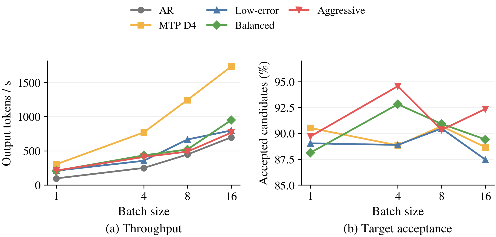
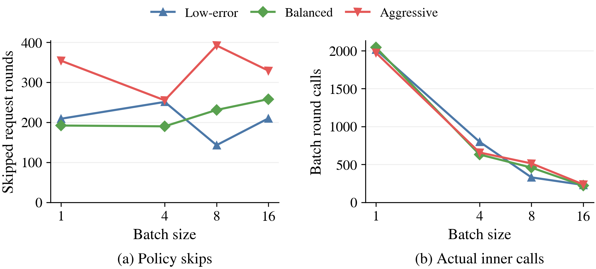

# Gemma h4 三档停止策略：16×512 性能矩阵

20 个配置已完成并通过样本、计数及预验证热图覆盖审计。输出与 AR 的逐 token 一致性另列，审计完成不等于严格等价通过。

同一份 16 请求，输出 512，B1/4/8/16，TP1，greedy，ignore_eos，raw prompt，同步调度，关闭 prefix cache。每配置先 warmup 16×64；正式阶段若新增预验证图则重测，保留全部 attempt。每配置仅一轮有效测量，不作统计显著性判断。

## 主要结论

1. MTP D4 在 B1/4/8/16 均最快：相对 AR 为 3.131×、3.082×、2.786×、2.485×。三档三级解码相对 AR 为 1.094–2.189×，吞吐仅为 MTP 的 39.3–69.9%。这是当前不同输出轨迹下的实测性能，严格输出等价尚未通过。
2. 三级内部最快档位随 batch 改变：B1 aggressive，B4 balanced，B8 low_error，B16 balanced。B1 aggressive 仅比默认档快约 1.1%，单次测量不支持显著性结论。保留 low_error 默认设置。
3. 更多提前停止不保证更快。B8 aggressive 比 low_error 跳过更多请求内轮（392 vs 143），但实际批量内轮调用更多（514 vs 330），Target 调用更多（153 vs 86），吞吐低 26.6%。每次外层验证平均接受候选也从 15.57 降到 13.36。计数与时间符合“更短候选可能带来更多外层周期”的解释，但不同输出轨迹使其不能构成单一因果证明。
4. 三级外层接受率为 87.5–94.6%，每次验证平均接受 13.36–15.57 个候选；MTP 为 88.7–90.7% 与 3.55–3.63 个。较长接受序列没有抵消当前三级执行成本。已有代码中的多轮 MTP/Pre-Verify、批量压缩、eager compact prefill 是后续分阶段计时的检查对象；本次没有 GPU 分阶段耗时，不能量化各项占比。

## 一致性与结论边界

- 与同 batch AR 的 512-token 序列完全相同请求：MTP 为每配置 4–6/16；三级为 0–6/16。不能把这份结果表述为已验证的无损加速，也不能把该比例当作任务准确率。
- AR 自身跨 batch 也不同：B4/B8/B16 对 B1 完全相同请求分别为 4/16、5/16、4/16。由此不能将输出分歧直接归因于早停。需要固定前缀重放，比较相同位置的 Target logits、Top-1/Top-2 间距及状态一致性。
- 本矩阵未包含关闭早停的四轮 `none` 对照，不能据此算出早停相对原三级的净加速；停止后未生成的反事实 token 没有外层验证标签，因此本次也不能重算真实误停率。
- 跳过请求内轮是策略触发计数，实际批量内轮调用是运行次数，两者单位不同；都不是 GPU 时间节省比例。每配置只用同一批 16 条样本的一次有效测量，无误差条或显著性判断。
- 对当前继续优化的启示：先固定输出前缀排除一致性混杂，再补 `none` 对照和重复测量；在接受长度与 correction margin 外，评估当前候选长度、轮次和仍活跃请求数对实际净耗时的影响。该扩展尚未实现或实测。

## 吞吐与接受情况

| B | 方案 | tok/s | 相对 AR | 相对 MTP | 外层接受率 | 平均接受 Draft | 与 AR 完全相同请求 |
| --- | --- | ---: | ---: | ---: | ---: | ---: | ---: |
| 1 | ar | 96.83 | 1.000× | 0.319× | — | — | 16/16 |
| 1 | mtp | 303.13 | 3.131× | 1.000× | 90.5% | 3.62 | 5/16 |
| 1 | low_error | 209.63 | 2.165× | 0.692× | 89.0% | 14.46 | 5/16 |
| 1 | balanced | 208.23 | 2.151× | 0.687× | 88.1% | 14.36 | 5/16 |
| 1 | aggressive | 211.91 | 2.189× | 0.699× | 89.7% | 13.81 | 5/16 |
| 4 | ar | 249.59 | 1.000× | 0.325× | — | — | 16/16 |
| 4 | mtp | 769.15 | 3.082× | 1.000× | 88.8% | 3.55 | 6/16 |
| 4 | low_error | 354.57 | 1.421× | 0.461× | 88.9% | 13.70 | 1/16 |
| 4 | balanced | 433.38 | 1.736× | 0.563× | 92.8% | 15.37 | 5/16 |
| 4 | aggressive | 409.76 | 1.642× | 0.533× | 94.6% | 15.34 | 0/16 |
| 8 | ar | 446.69 | 1.000× | 0.359× | — | — | 16/16 |
| 8 | mtp | 1244.30 | 2.786× | 1.000× | 90.7% | 3.63 | 4/16 |
| 8 | low_error | 665.83 | 1.491× | 0.535× | 90.5% | 15.57 | 4/16 |
| 8 | balanced | 520.68 | 1.166× | 0.418× | 90.9% | 14.25 | 6/16 |
| 8 | aggressive | 488.51 | 1.094× | 0.393× | 90.3% | 13.36 | 6/16 |
| 16 | ar | 697.37 | 1.000× | 0.402× | — | — | 16/16 |
| 16 | mtp | 1732.96 | 2.485× | 1.000× | 88.7% | 3.55 | 4/16 |
| 16 | low_error | 797.68 | 1.144× | 0.460× | 87.5% | 14.09 | 5/16 |
| 16 | balanced | 949.41 | 1.361× | 0.548× | 89.4% | 14.06 | 5/16 |
| 16 | aggressive | 765.81 | 1.098× | 0.442× | 92.4% | 14.31 | 4/16 |

## 内层计算

| B | 方案 | Target 调用 | 请求内轮 | 批量内轮调用 | 提前停止 | 跳过请求内轮 | 内层接受率 |
| --- | --- | ---: | ---: | ---: | ---: | ---: | ---: |
| 1 | low_error | 572 | 2015 | 2015 | 89 | 209 | 87.7% |
| 1 | balanced | 575 | 2044 | 2044 | 84 | 192 | 87.0% |
| 1 | aggressive | 598 | 1974 | 1974 | 146 | 354 | 89.1% |
| 4 | low_error | 215 | 2081 | 799 | 117 | 251 | 83.7% |
| 4 | balanced | 164 | 1910 | 631 | 81 | 190 | 89.3% |
| 4 | aggressive | 173 | 1857 | 658 | 104 | 255 | 91.1% |
| 8 | low_error | 86 | 1933 | 330 | 60 | 143 | 91.1% |
| 8 | balanced | 120 | 2017 | 459 | 99 | 231 | 84.8% |
| 8 | aggressive | 153 | 1992 | 514 | 162 | 392 | 86.6% |
| 16 | low_error | 59 | 2062 | 230 | 87 | 210 | 86.6% |
| 16 | balanced | 57 | 2030 | 221 | 111 | 258 | 86.5% |
| 16 | aggressive | 62 | 1915 | 237 | 138 | 329 | 89.2% |

## 解释与证据

low_error：L=0 时 M<2，否则 M<0.25；balanced：M<1；aggressive：M<2。L 为本轮接受长度，M 为 correction 的 Pre-Verify Top-1/Top-2 margin。

吞吐包含 generate 内的 prefill/decode，排除模型加载与 warmup。外层接受率不含 Target bonus；Target 调用包含 prefill。跳过请求内轮不是 GPU 耗时节省比例，也不能直接当作实际误停率。多请求路径压缩已停止请求，后续 MTP prefill 使用 fresh eager metadata；MTP decode 与 Pre-Verify 保留 CUDA Graph。

完整 summary.csv、output_comparisons.csv、各配置 outputs/counters/attempts、源码快照与运行配置在 raw_evidence.tar.gz 中。两张图均已检查实际 PNG 与 PDF 渲染；PDF 各一页，布局与 PNG 一致。

AI assistance was used for implementation, tests, and analysis.
