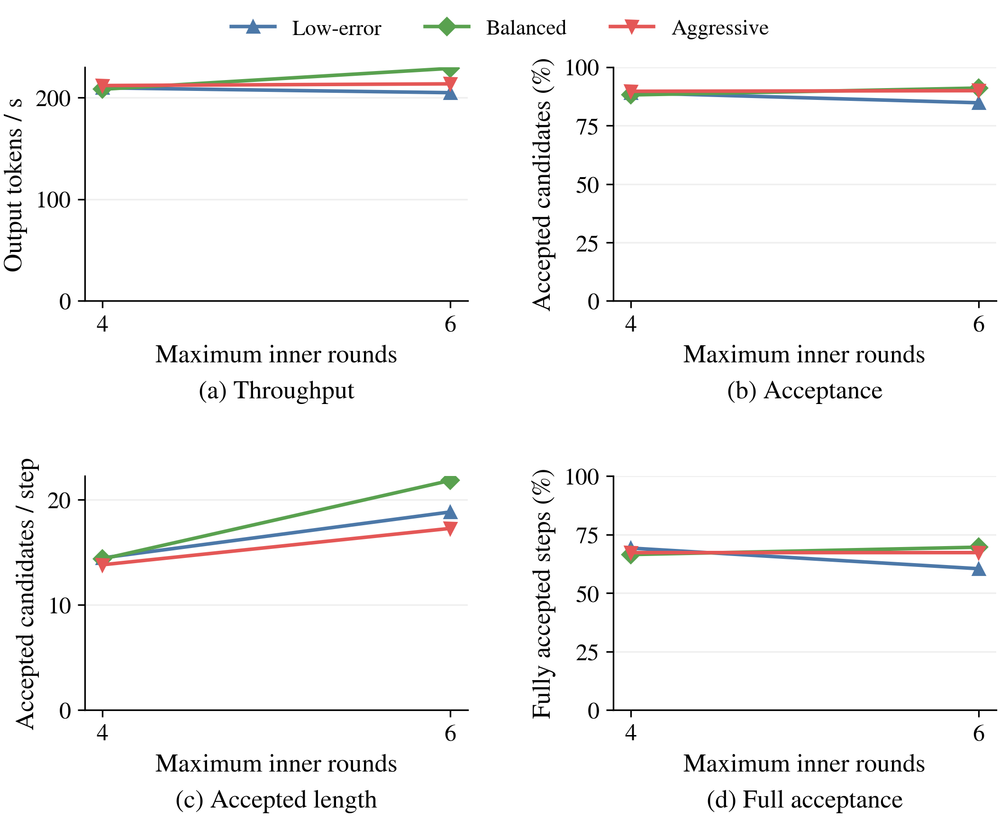
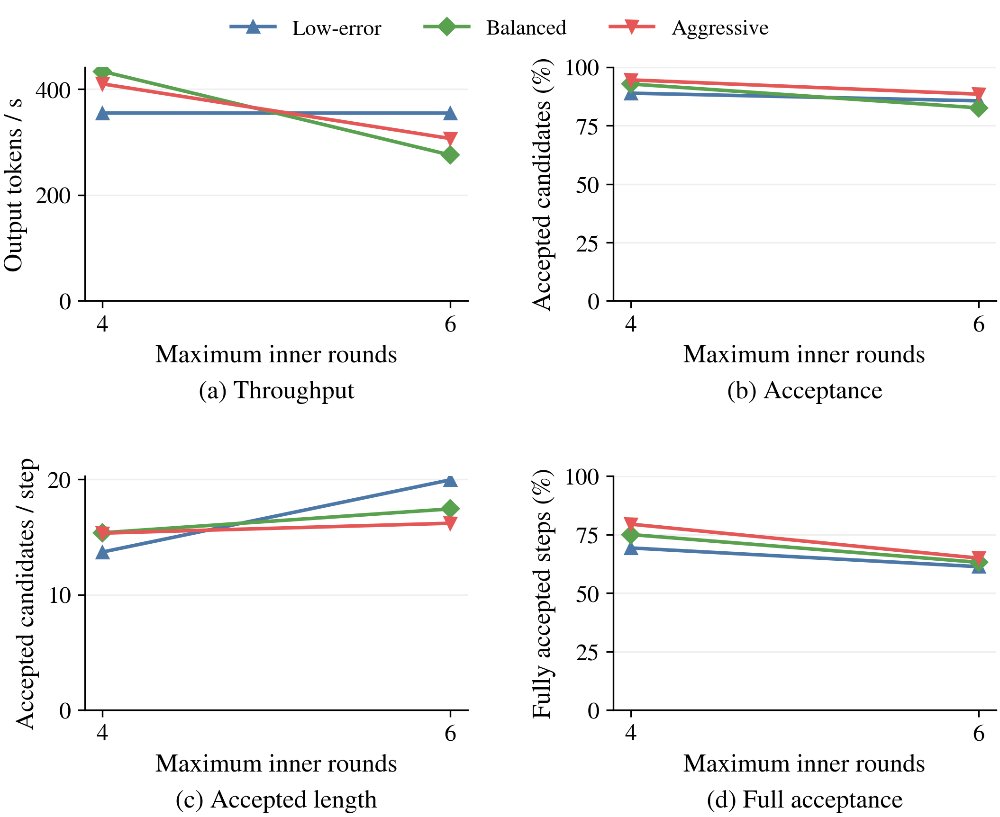
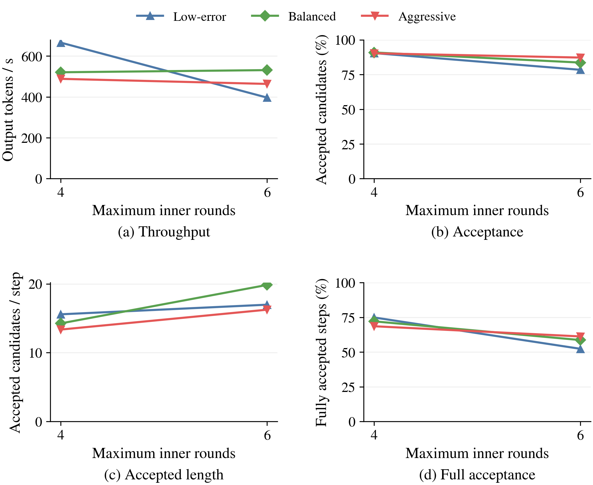
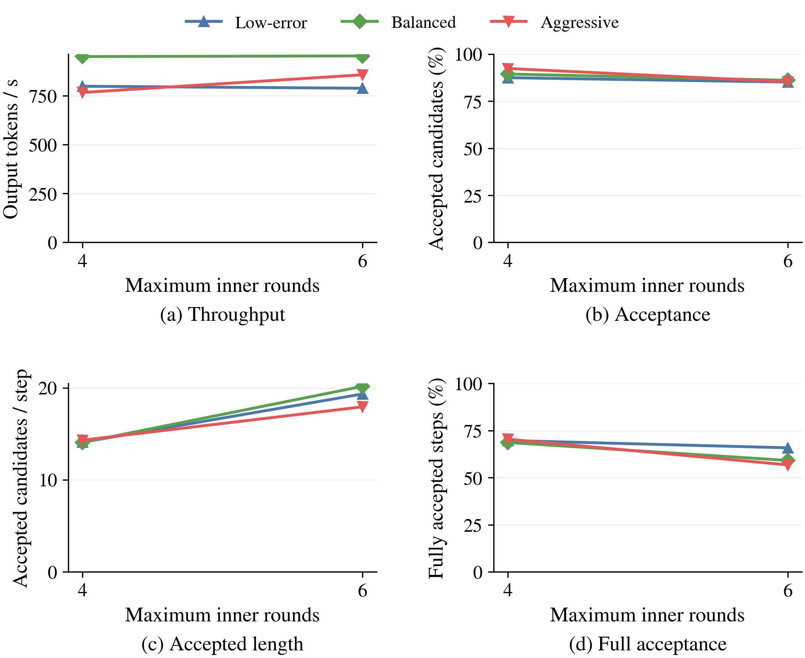

# h4 D4 三档停止信号：4/6 轮比较

## 结论

用户已取消八轮：未启动任何八轮测量。本报告仅比较 12 个六轮新配置与 12 个四轮历史配置，D4、h4、三档信号、16×512 与 B1/4/8/16 不变；均在 GPU0 完成。候选容量由 20 增至 30。

- 默认 low_error 从四轮增至六轮，B1/4/8/16 吞吐分别变化 −2.27%、−0.02%、−40.44%、−1.30%。建议保留四轮默认上限。
- 相对同档四轮，六轮较明显的单次提升为 B1 balanced +9.87% 与 B16 aggressive +11.80%；后者仍低于四轮 balanced 的 949.41 tokens/s。B8 balanced +2.02%、B16 balanced +0.34% 均不宜视为稳定收益。
- 所有配置平均接受长度都增加，但只有 5/12 个配置的吞吐数值提高，其中三个增幅不超过 2.1%。接受长度增长不是充分的性能判据。
- B8 默认档每次平均接受从 15.57 升至 16.97，但 Target 调用从 86 增至 125，实际批量内轮调用从 330 增至 697；不同输出轨迹和批量执行进度会影响这类比较，计数不能单独证明因果。
- 六轮满 30-token 候选时全接受比例仍为 85.07%–94.34%，说明顺畅段可以继续延长；但所有外层周期中的整段全接受概率为 52.36%–69.65%，不能用前者代表总体。
- 六轮输出与同 batch AR 完全相同请求为每配置 1–7/16，与同档四轮为 0–7/16。严格输出等价未通过；性能变化不能全部归因于轮数。
- 每配置一次有效测量；B16 aggressive 首次计时新增预验证图，已排除并采用第二次稳定测量。无统计显著性结论。

## 吞吐变化

| Batch | Policy | R4 tok/s | R6 tok/s | 变化 |
| --- | --- | ---: | ---: | ---: |
| 1 | low_error | 209.63 | 204.87 | -2.27% |
| 1 | balanced | 208.23 | 228.79 | +9.87% |
| 1 | aggressive | 211.91 | 213.57 | +0.78% |
| 4 | low_error | 354.57 | 354.51 | -0.02% |
| 4 | balanced | 433.38 | 275.39 | -36.46% |
| 4 | aggressive | 409.76 | 306.50 | -25.20% |
| 8 | low_error | 665.83 | 396.60 | -40.44% |
| 8 | balanced | 520.68 | 531.22 | +2.02% |
| 8 | aggressive | 488.51 | 463.65 | -5.09% |
| 16 | low_error | 797.68 | 787.34 | -1.30% |
| 16 | balanced | 949.41 | 952.63 | +0.34% |
| 16 | aggressive | 765.81 | 856.15 | +11.80% |

## 图表

### Batch 1

### Batch 4

### Batch 8

### Batch 16

12 个新增配置完整，合并此前 12 个四轮配置。16 条相同样本，每条输出 512，B1/4/8/16。四轮是历史测量，增加轮数的配置是本次新测量；每配置一次热图覆盖稳定的测量，无误差条或显著性结论。

| B | Policy | R | tok/s | vs R4 | 接受率 | 平均提交 | 平均接受 | 全接受概率 | 满容量全接受概率 | 满容量次数 |
| --- | --- | ---: | ---: | ---: | ---: | ---: | ---: | ---: | ---: | ---: |
| 1 | aggressive | 4 | 211.91 | 1.000 | 89.69% | 15.39 | 13.81 | 67.31% | 87.68% | 349 |
| 1 | aggressive | 6 | 213.57 | 1.008 | 89.94% | 19.20 | 17.27 | 67.32% | 91.71% | 217 |
| 1 | balanced | 4 | 208.23 | 1.000 | 88.12% | 16.29 | 14.36 | 66.48% | 90.12% | 324 |
| 1 | balanced | 6 | 228.79 | 1.099 | 91.06% | 23.98 | 21.83 | 69.65% | 91.98% | 237 |
| 1 | low_error | 4 | 209.63 | 1.000 | 89.03% | 16.24 | 14.46 | 69.26% | 90.75% | 335 |
| 1 | low_error | 6 | 204.87 | 0.977 | 84.76% | 22.22 | 18.83 | 60.43% | 91.00% | 211 |
| 4 | aggressive | 4 | 409.76 | 1.000 | 94.56% | 16.22 | 15.34 | 79.49% | 94.25% | 348 |
| 4 | aggressive | 6 | 306.50 | 0.748 | 88.45% | 18.32 | 16.20 | 64.96% | 92.42% | 198 |
| 4 | balanced | 4 | 433.38 | 1.000 | 92.81% | 16.56 | 15.37 | 75.05% | 95.36% | 345 |
| 4 | balanced | 6 | 275.39 | 0.635 | 82.58% | 21.12 | 17.45 | 63.16% | 91.53% | 177 |
| 4 | low_error | 4 | 354.57 | 1.000 | 88.88% | 15.42 | 13.70 | 69.31% | 91.80% | 305 |
| 4 | low_error | 6 | 354.51 | 1.000 | 85.59% | 23.33 | 19.97 | 61.31% | 88.89% | 234 |
| 8 | aggressive | 4 | 488.51 | 1.000 | 90.33% | 14.79 | 13.36 | 68.62% | 91.74% | 339 |
| 8 | aggressive | 6 | 463.65 | 0.949 | 87.25% | 18.62 | 16.25 | 61.27% | 88.99% | 218 |
| 8 | balanced | 4 | 520.68 | 1.000 | 90.91% | 15.68 | 14.25 | 72.16% | 94.83% | 329 |
| 8 | balanced | 6 | 531.22 | 1.020 | 83.64% | 23.73 | 19.84 | 58.66% | 87.45% | 231 |
| 8 | low_error | 4 | 665.83 | 1.000 | 90.47% | 17.21 | 15.57 | 74.95% | 92.74% | 358 |
| 8 | low_error | 6 | 396.60 | 0.596 | 78.42% | 21.64 | 16.97 | 52.36% | 90.59% | 202 |
| 16 | aggressive | 4 | 765.81 | 1.000 | 92.35% | 15.50 | 14.31 | 70.46% | 93.27% | 342 |
| 16 | aggressive | 6 | 856.15 | 1.118 | 85.28% | 21.04 | 17.94 | 56.79% | 85.07% | 221 |
| 16 | balanced | 4 | 949.41 | 1.000 | 89.41% | 15.73 | 14.06 | 68.71% | 92.38% | 328 |
| 16 | balanced | 6 | 952.63 | 1.003 | 86.09% | 23.42 | 20.16 | 59.15% | 89.45% | 218 |
| 16 | low_error | 4 | 797.68 | 1.000 | 87.46% | 16.11 | 14.09 | 69.75% | 90.30% | 330 |
| 16 | low_error | 6 | 787.34 | 0.987 | 85.14% | 22.71 | 19.33 | 65.86% | 94.34% | 212 |

## 指标与边界

- 接受率为接受候选总数/提交候选总数；平均接受长度不含 Target token。
- 全接受概率为 A=D 的非空请求验证次数/非空请求验证总次数；满容量概率条件为 D=5R。均为经验频率，包含最后一次验证。
- 输出长度边界可能截断最后一次已接受候选。逐步计数保留原始定义。
- 跳过请求内轮不是 GPU 时间节省；各策略生成轨迹可能不同。与同 batch AR 和同策略四轮输出的逐 token 一致性单独报告。
- 固定四轮无早停对照不在本次范围；不能推导真实反事实误停率。
- 四轮源码为 db1b2cee33，六轮源码为 7b6dfb28ff 加 benchmark 参数改动。版本间增加 Qwen 专用 replay_tail；Gemma 不含 Qwen GDN 层且 GDN 模式为 none。逐项审查后仅允许 source_compatibility.json 列出的两个精确指纹对；不是整个仓库逐字节相同。Gemma 的 speculator 和 batched 路径未变。
- AI assistance was used for benchmark implementation and analysis.
