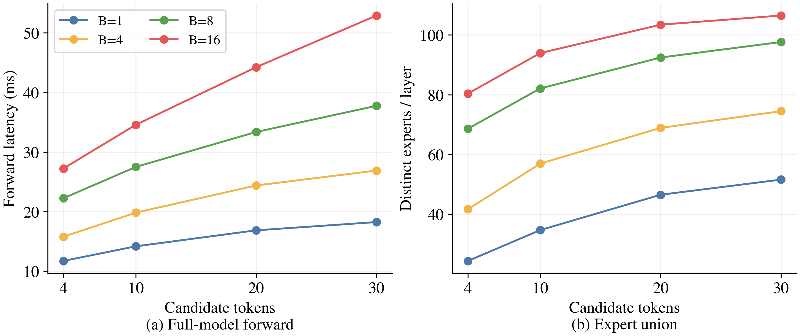
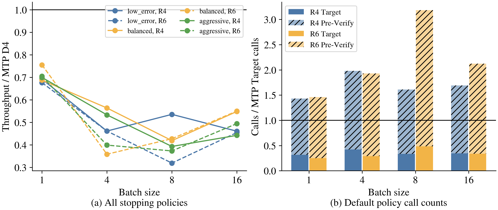

# 三级解码相对原生 MTP D4 的成本诊断

## 问题与口径

本报告分析 Gemma4、h4 Pre-Verify、MTP D4、三档停止策略的三级解码。
主基线是原生 MTP D4；R4/R6 只是三级机制内部的对比。
端到端数据来自此前完整 16×512、B1/4/8/16 矩阵。
本次额外做固定前缀的验证宽度微测量，不重跑端到端矩阵，不运行 R8。

微测量在 GPU0 A100 80GB 上执行，BF16、TP1、同一模型实例，
前缀为原始 prompt 加历史 AR 输出的前 64 token。
每个 B 使用前 B 条请求，各宽度使用同一候选序列的嵌套前缀。
微测量使用进程内引擎，确保请求全部入队后才开始执行，以固定实际 B。
早期独立引擎进程探针在要求 B4 时首批实际为 B1，被断言拒绝；
此前 B1 数据未混入最终微测量。
候选长度 4/10/20/30 对应实际验证宽度 5/11/21/31。
完整 h8 与 h4 都走 private Pre-Verify metadata 路径；h8 是
Target 完整模型前向的代理测量，**不是原生 execute_model 的阶段计时**。
计时包括 backbone、LM head、top2 和 argmax，不含组批、scheduler、
MTP proposal、采样 bookkeeping；原生 Target 不需要这里额外的 margin top2。
手工捕获 CUDA Graph，20 次预热后的重放，冷 L2。
环境未安装 cupti-python，FlashInfer 回退到 CUDA event，未安装依赖。
专家并集在另一次不计时的前向采集；每个形状核对 eager/graph 输出一致，
每个 B 核对插桩前后 4-token 生成输出一致。
这些检查只验证诊断没有改变此次短输出，不代表三级与 AR 严格等价。

## 本次固定输入微测量

20 个形状/路由配置、400 次计时重放完成，所有 eager/graph 与短输出控制通过。

| B | D4/W5 ms | D10/W11 ms | D20/W21 ms | D30/W31 ms | W31/W5 | 专家并集 W5→W31 |
| --- | ---: | ---: | ---: | ---: | ---: | ---: |
| 1 | 11.714 | 14.158 | 16.848 | 18.231 | 1.556× | 24.30→51.53 |
| 4 | 15.778 | 19.808 | 24.371 | 26.878 | 1.703× | 41.63→74.47 |
| 8 | 22.235 | 27.479 | 33.350 | 37.744 | 1.698× | 68.60→97.63 |
| 16 | 27.227 | 34.548 | 44.222 | 52.892 | 1.943× | 80.37→106.50 |

时间是 20 次重放中位数，专家并集是 30 层的均值。
W5→W31 的 query 数增长 6.2 倍，时延增长 1.56–1.94 倍；
长验证仍有明显的 token 摊销收益，但一次调用绝不能当作固定成本。
本例不支持“小 batch 的相对涨幅特别剧烈”：B16 的相对涨幅反而最大。
专家并集在 B16 的相对增长更小，时延增长却更大，也说明总耗时不能只看并集。

| B | h8 W5 ms | h4 W5 ms | h4/h8 |
| --- | ---: | ---: | ---: |
| 1 | 11.714 | 10.046 | 85.76% |
| 4 | 15.778 | 12.377 | 78.44% |
| 8 | 22.235 | 17.317 | 77.88% |
| 16 | 27.227 | 22.260 | 81.76% |

这复核了 Pre-Verify 仍然昂贵。一个只说明成本关系的 B1 理想化例子：
假设两者所有候选全接受，忽略双方 Draft 与 host 开销，四轮三级最多输出
21 token，需要约 `4×10.046 + 16.848 = 57.032 ms`，即 2.716 ms/token；
MTP D4 则为 `11.714/5 = 2.343 ms/token`。按本探针前向成本，
**即使接受完美，三级额外 PV 开销也能抵消长 Target 的摊销收益**。
这是假设性成本例子，不是 E2E 预测：两者真实 Draft 次数/时延、Target 路径、
PV 不同位置的路由及输出都没有在该算式中建模。

## 端到端：问题在 R4 已经存在

| B | MTP D4 tok/s | R4 默认 | R6 默认 | R4 三档最好 | R6 三档最好 |
| --- | ---: | ---: | ---: | ---: | ---: |
| 1 | 303.13 | 209.63 | 204.87 | 211.91 | 228.79 |
| 4 | 769.15 | 354.57 | 354.51 | 433.38 | 354.51 |
| 8 | 1244.30 | 665.83 | 396.60 | 665.83 | 531.22 |
| 16 | 1732.96 | 797.68 | 787.34 | 949.41 | 952.63 |

“三档最好”是每个 B 的事后最大值，不是一个可预先选择的统一策略。
R4/R6 所有 24 个三级配置都低于 MTP D4。

| B | MTP Target 调用 | R4 Target | R4 Pre-Verify | R6 Target | R6 Pre-Verify |
| --- | ---: | ---: | ---: | ---: | ---: |
| 1 | 1809 | 572 | 2015 | 454 | 2192 |
| 4 | 512 | 215 | 799 | 149 | 838 |
| 8 | 258 | 86 | 330 | 125 | 697 |
| 16 | 171 | 59 | 230 | 58 | 305 |

以上三级列均为默认 low_error。调用是实际批量调用，不是请求级接受周期。
Target 计数含 prefill；不同宽度、批量和模型路径的调用不能等价相加为时间。
但这解释了为何仅看“节省 Target 调用数”会漏掉最重要的一笔新增开销。

## 性能失效的完整链条

### 1. Pre-Verify 并不便宜，且计算结果不能替代 Target 验证

h4 只减少 routed top-k，保留 30 层、attention、始终执行的 dense MLP、
norm、router 和大词表 LM head。减少一半专家不等于前向时间减半。
Pre-Verify 的近似 hidden/KV 不能直接当作完整 Target 的精确结果；
候选仍需在 Target 上重新前向。
历史 2026-09-10 同输入 B1/W5 测量为 h8 11.073 ms、h4 9.675 ms，
h4 仍为 h8 的 87.4%。该历史测量不含本次新增 margin top2，且前缀不同。
因此不能把其绝对毫秒与本次或旧 E2E 直接混算为真实阶段占比。

### 2. 长草稿的 Target 调用更贵，专家并集只是其中一个因素

单 token 仍选择 8 个专家。随 B×W 增大，**一层中整个验证块访问的专家并集**
通常增大，权重读取复用条件随之改变；最多达到 128 个。
专家计算的 token-expert assignments 仍随 B×W×8 增长，即使并集已饱和。
此外 attention、dense MLP、LM head、top2 和 kernel 配置也随形状改变。
所以不能将整段前向的时间增长全部归因于专家数量。
本次专家并集与总时延的联测是相关证据，尚未固定 token 数并强制重映射
路由来隔离专家并集的因果贡献。

### 3. 批内阶段屏障将逐请求停止变成小批量尾部执行

`batched.py` 在每一轮移除已停止的请求，剩余请求继续执行；
但 `propose_gemma()` 只有在整个批次完成时才返回。
已经准备好验证的请求不能在该函数执行期间独立进入 Target 或下一外层周期。
因此请求层面节省了后续轮次，并不保证省掉同等比例的 GPU 时间。

默认档每次 Pre-Verify 实际平均活跃请求数：

| 原始 B | R4 | R6 |
| --- | ---: | ---: |
| 4 | 2.60 | 2.53 |
| 8 | 5.86 | 3.47 |
| 16 | 8.97 | 7.21 |

口径是 request_inner_rounds / batch_inner_calls。这同时可能包含请求到达、
轮内提前退出和固定样本组的完成尾部，现有汇总计数不能分别量化这些原因。
请求分批到达也可能影响 MTP，不能将其全部当作三级特有损失。
B8 默认 R4→R6：请求级外层周期 503→466，却有实际 Target 调用 86→125、
Pre-Verify 调用 330→697；“单请求接受更多”没有变成更少的实际批量执行。
不同输出轨迹也是这些变化的混杂因素，不能把增幅全归因于屏障。

### 4. 压缩后的后续 MTP 失去 CUDA Graph

`batched.py` 的后续 `small.propose(..., is_profile=True)`，会通过
autoregressive speculator 的 `need_eager=is_profile` 同时令 prefill 和 decode
选择 `CUDAGraphMode.NONE`。Gemma fused multistep decode 也只有在 FULL 模式
才 replay graph，否则调用 eager 生成函数。
这项实现开销相对原生 MTP D4 不对称；Pre-Verify 自身有图，不能据此认为
整个三级周期都有图。尚未做只修复此路径的 E2E 消融，不报告其独占百分比。

### 5. 每轮 CPU 同步和批量重建进入串行关键路径

每轮接受长度和 margin 都通过 `.cpu().tolist()` 回传，随后 Python 逐请求
决定是否继续，重建索引、tokens、positions、attention metadata、slot mapping。
小活跃批量下，这些固定开销更难摊薄。固定输入 graph 微测量不包含这些开销，
所以不能拿微测量总和冒充 E2E 的完整阶段分解。

### 6. 信号预测“会不会接受”，尚未预测“继续算是否划算”

三档策略只在内层拒绝后考察 correction margin，且当前轮成本已支付。
它们并不是未来拒绝的 oracle，也不考虑当前活跃 B、Target 宽度增长、
等待队列和下一轮 MTP 是否 eager。高接受率的后续轮次也可能是不划算的轮次。

令 C 为累计周期时间，G 为最终有效输出；延长一轮只有在
`ΔC / ΔG < C / G` 时改善该周期的每 token 成本。
这里 ΔC 包括新增 Draft、Pre-Verify、组批等待，以及变长后的 Target 增量；
ΔG 必须是最终通过 Target 的新增 token，不能用内层接受数直接代替。
与 MTP 比较还要让整个三级周期的 C/G 低于原生 MTP 的 C/G。

## 优化优先级

1. 先修复压缩后 MTP 的 graph 路径和 CPU 同步/metadata 开销；保持三档和
   候选选择不变，做成对输出检查和 E2E 消融，分离实现损失。
2. 加入实际活跃 B、预计 Target 宽度成本和等待请求数，让停止策略优化
   预计 ms/有效 token；用同前缀反事实测试评估误停收益，而非只优化分类精度。
3. 将 ready-to-verify 与继续 draft 的序列分队列，按阶段重组批；设置最小
   有效批量或等待预算。不能简单每条请求独立 Target，否则会牺牲 Target 吞吐。
4. 降低 Pre-Verify 单次成本。若它仍接近完整 Target 的代价，仅提高硬轮数
   或继续调 margin 难以解决相对 MTP 的根本成本问题。

## 证据限制

此前每个 E2E 配置仅一次有效测量，四轮是历史结果，输出也不完全一致。
R6 对 AR 的逐请求完整 512-token 一致性只有 1–7/16；AR 自身跨批量也有差异。
因此这些结果是当前实现的性能观察，不是已证明 lossless 的加速结论。
本次短前缀微测量不能替代长上下文、多前缀、真实异长候选及服务调度评估。
尚无完整周期的互斥 GPU/CPU 时间分解，不虚构各原因的百分比。

## 复现与文件

- 原始本次数据：`benchmark_results/gemma_verify_width_20260916/`。
- 微测量：`benchmarks/hierarchical/run_verify_width_probe.py`。
- 分析：`benchmarks/hierarchical/analyze_verify_width.py`。
- 本目录 `summary.csv` / `summary.json` 为新测量汇总。
- `verify_width/` 为时延与专家并集图；`mtp_cost_comparison/` 为历史 MTP 对比。
- 完整模型推理代码未修改；新增的是诊断与分析代码。
