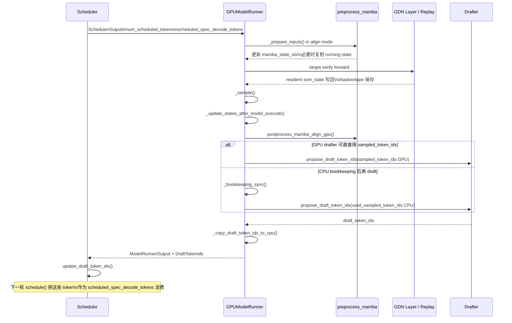
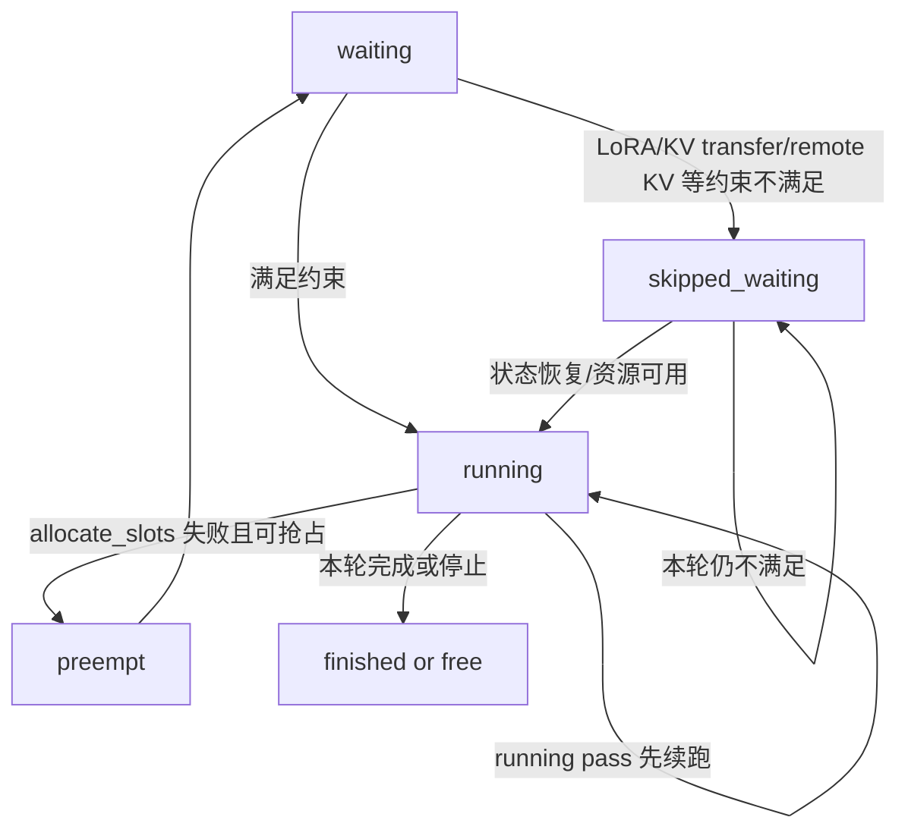
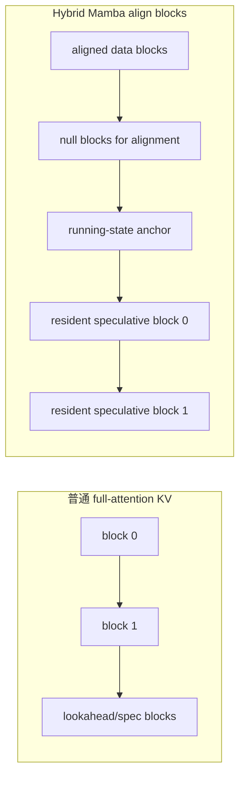
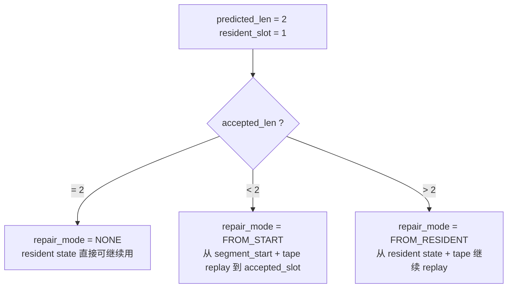

# Qwen3.5 / Qwen3.6 Hybrid Spec Decode Walkthrough

## 1. 范围与结论先读

这份文档只解释当前 checkout 里的真实实现，不讨论历史版本，也不把“理想 redesign”混写成现状。

- 范围锁定在 `vllm/v1` runner。
- 模型锁定在 Qwen3.5 / Qwen3.6 hybrid GDN 线性注意力层。
- cache 语义锁定在 `mamba_cache_mode="align"`。
- spec 状态语义锁定在当前树上的 `predict_last` + replay 路径。
- 图和例子都只服务于理解当前代码，不代表额外的实验结论。

先给结论：

1. scheduler 没有硬编码的“prefill phase / decode phase”切换；它只追每个 request 的 `num_computed_tokens -> num_tokens_with_spec` 追平过程。源码直接把这一点写在 `Scheduler.schedule()` 注释里。源码锚点：`vllm/v1/core/sched/scheduler.py:329-339`
2. `scheduled_spec_decode_tokens` 代表“本轮 target forward 要验证的 draft token”，不是“下一轮才第一次出现的 token”。源码锚点：`vllm/v1/core/sched/scheduler.py:501-517`
3. hybrid spec decode 的难点不在普通 full-attention KV，而在 GDN / Mamba 这条线的 running state、accepted progress、replay checkpoint 和 block 对齐。源码锚点：`vllm/v1/worker/mamba_utils.py:688-758`、`vllm/model_executor/layers/mamba/gdn/qwen_gdn_linear_attn.py:1461-1545`
4. 当前 live tree 的 `predict_last` 不是“verify 全程只留 1 份 GPU state”。persistent resident 语义确实只保留预测接受位置，但 layer 内仍会准备 verify 初始态、resident metadata、segment-start checkpoint 和 per-token replay tape。源码锚点：`vllm/model_executor/layers/mamba/gdn/hybrid_temporal_replay.py:36-89`、`vllm/model_executor/layers/fla/ops/fused_sigmoid_gating.py:880-944`

## 2. 源码地图

这条链路最值得反复对照的文件如下。

### 调度与输出 contract

- `vllm/v1/core/sched/output.py`
  - `NewRequestData`：新请求第一次下发给 worker 的静态信息，包含 prompt、`block_ids`、`num_computed_tokens` 等。源码锚点：`vllm/v1/core/sched/output.py:30-65`
  - `CachedRequestData`：已经缓存过的请求，本轮只增量下发 block/token diff。源码锚点：`vllm/v1/core/sched/output.py:111-177`
  - `SchedulerOutput`：一次调度的最终产物，里面最重要的是 `num_scheduled_tokens` 和 `scheduled_spec_decode_tokens`。源码锚点：`vllm/v1/core/sched/output.py:180-233`
- `vllm/v1/core/sched/scheduler.py`
  - `schedule()`：running 续跑、waiting 晋升、token/block budget、spec token 裁剪都在这里。源码锚点：`vllm/v1/core/sched/scheduler.py:329-525`、`vllm/v1/core/sched/scheduler.py:546-830`
  - `update_from_output()`：根据 accepted / rejected 回写 `num_computed_tokens` 和 request 状态。源码锚点：`vllm/v1/core/sched/scheduler.py:1283-1545`
  - `update_draft_token_ids()`：把上一轮 drafter 产出的草稿挂回 request，供下一轮 `schedule()` 消费。源码锚点：`vllm/v1/core/sched/scheduler.py:1691-1711`

### KV / Mamba block 与 cache 记账

- `vllm/v1/kv_cache_interface.py`
  - `MambaSpec`：`num_speculative_blocks`、`resident_speculative_blocks`、`max_memory_usage_bytes()` 都在这里。源码锚点：`vllm/v1/kv_cache_interface.py:563-599`
- `vllm/model_executor/layers/mamba/abstract.py`
  - hybrid GDN 层如何生成自己的 `MambaSpec`。源码锚点：`vllm/model_executor/layers/mamba/abstract.py:44-67`
- `vllm/config/speculative.py`
  - `resident_speculative_mamba_blocks()` 在 hybrid spec state offload 打开时直接返回 `0`。源码锚点：`vllm/config/speculative.py:1082-1088`
- `vllm/v1/core/single_type_kv_cache_manager.py`
  - `MambaManager.get_num_blocks_to_allocate()` 和 `allocate_new_blocks()` 决定 `align` 模式下 block 如何补、如何复用旧 speculative blocks、何时插入 null blocks。源码锚点：`vllm/v1/core/single_type_kv_cache_manager.py:944-1088`

### 执行主线

- `vllm/v1/worker/gpu_model_runner.py`
  - `_prepare_inputs()`：准备 positions、block table、spec metadata、accepted-token 计数。源码锚点：`vllm/v1/worker/gpu_model_runner.py:2862-3180`
  - `align` 路径下调用 `preprocess_mamba()`。源码锚点：`vllm/v1/worker/gpu_model_runner.py:5117-5159`
  - `_sample()` / `sample_tokens()`：sample、state update、bookkeeping、drafter 调用顺序都在这里。源码锚点：`vllm/v1/worker/gpu_model_runner.py:4489-4518`、`vllm/v1/worker/gpu_model_runner.py:5331-5599`
  - `_update_states_after_model_execute()`：accepted length 统计、repair mode 更新、`postprocess_mamba_align_gpu()` 调用。源码锚点：`vllm/v1/worker/gpu_model_runner.py:2469-2518`
- `vllm/v1/worker/mamba_utils.py`
  - `preprocess_mamba()`：把上一轮 running state 搬到当前 logical running block。源码锚点：`vllm/v1/worker/mamba_utils.py:688-758`
  - `postprocess_mamba_align_gpu()`：根据 accepted count 在 GPU 上完成 align-mode 的 postprocess。源码锚点：`vllm/v1/worker/mamba_utils.py:806-859`

### Hybrid layer 与 replay helper

- `vllm/v1/attention/backends/gdn_attn.py`
  - `mamba_get_running_state_block_ids()`：把 block table 和 seq lens 变成运行态 block id。源码锚点：`vllm/v1/attention/backends/gdn_attn.py:87-109`
  - metadata builder：spec rows / non-spec rows 切分，混合 batch 下非 spec decode 行重分流到 prefill kernel 路径。源码锚点：`vllm/v1/attention/backends/gdn_attn.py:225-319`、`vllm/v1/attention/backends/gdn_attn.py:412-603`
- `vllm/v1/hybrid_spec_replay.py`
  - `HybridTemporalWavePlan`、`HybridTemporalGroupPlan`、`HybridTemporalRuntimeMetadataBundle`、`HybridSpecRepairMode` 的 contract。源码锚点：`vllm/v1/hybrid_spec_replay.py:10-107`
- `vllm/model_executor/layers/mamba/gdn/qwen_gdn_linear_attn.py`
  - spec verify 的 conv 路径、temporal verify 路径、resident metadata 和 replay artifact 落盘都在这里。源码锚点：`vllm/model_executor/layers/mamba/gdn/qwen_gdn_linear_attn.py:1392-1545`、`vllm/model_executor/layers/mamba/gdn/qwen_gdn_linear_attn.py:1611-1705`
- `vllm/model_executor/layers/mamba/gdn/hybrid_temporal_replay.py`
  - replay workspace、prepare、repair、spill/checkpoint 的真实 owner。源码锚点：`vllm/model_executor/layers/mamba/gdn/hybrid_temporal_replay.py:36-140`、`vllm/model_executor/layers/mamba/gdn/hybrid_temporal_replay.py:415-729`
- `vllm/model_executor/layers/fla/ops/fused_sigmoid_gating.py`
  - `capture_shadow_resident` 和 `replay_from_shadow_resident` 两个 fused kernel wrapper。源码锚点：`vllm/model_executor/layers/fla/ops/fused_sigmoid_gating.py:880-944`、`vllm/model_executor/layers/fla/ops/fused_sigmoid_gating.py:1046-1095`

## 3. 全局时序图

下面这张图把“一轮 verify 结束后，下一轮 draft 如何再被 scheduler 消费”串起来。



关键代码顺序：

- `_sample()` 先做目标模型采样。源码锚点：`vllm/v1/worker/gpu_model_runner.py:5374-5379`
- `_update_states_after_model_execute()` 在 draft proposer 之前运行，所以 accepted length 已经确定。源码锚点：`vllm/v1/worker/gpu_model_runner.py:5377-5379`
- GPU drafter 会在 bookkeeping 之前启动；CPU drafter 则在 bookkeeping 之后启动。源码锚点：`vllm/v1/worker/gpu_model_runner.py:5397-5511`
- drafter 结果通过 `take_draft_token_ids()` 从 worker 返回给 engine，再由 scheduler 写回 request。源码锚点：`vllm/v1/worker/gpu_model_runner.py:5648-5696`、`vllm/v1/engine/core.py:459-467`、`vllm/v1/core/sched/scheduler.py:1691-1711`

## 4. 调度部分详解

### 4.1 scheduler 不是 phase machine

`Scheduler.schedule()` 的注释直接说了：这里没有单独的 “decoding phase” 或 “prefill phase”；每个 request 只是在追平 `num_computed_tokens` 和 `num_tokens_with_spec`。这正是 chunked prefill、普通 decode、spec verify 能放进同一调度框架的原因。源码锚点：`vllm/v1/core/sched/scheduler.py:329-339`

### 4.2 `running`、`waiting`、`skipped_waiting` 三个队列

- `running`
  - 已经持有当前活跃执行资格的请求；本轮会先尝试给它们续跑。源码锚点：`vllm/v1/core/sched/scheduler.py:164-167`、`vllm/v1/core/sched/scheduler.py:364-365`
- `waiting`
  - 正常等待进入 active set 的请求。源码锚点：`vllm/v1/core/sched/scheduler.py:164`、`vllm/v1/core/sched/scheduler.py:548-555`
- `skipped_waiting`
  - 因异步 KV transfer、LoRA 约束、资源暂时不满足等原因本轮先跳过，但仍保留等待资格的请求。源码锚点：`vllm/v1/core/sched/scheduler.py:165-166`、`vllm/v1/core/sched/scheduler.py:558-569`、`vllm/v1/core/sched/scheduler.py:571-584`

`_select_waiting_queue_for_scheduling()` 会在 `waiting` 和 `skipped_waiting` 之间挑一个当前应该遍历的队列；如果启用了 priority policy，会基于队头 request 的优先级做选择。源码锚点：`vllm/v1/core/sched/scheduler.py:1619-1629`

### 4.3 为什么先扫 `running` 再扫 `waiting`

因为当前轮次的主要目标是先把已经 active 的请求往前推进，只有剩余 token budget / block budget / active-set 配额时，才继续从 waiting 拉新请求入场。

- running pass：`while req_index < len(self.running) and token_budget > 0`。源码锚点：`vllm/v1/core/sched/scheduler.py:366-367`
- waiting pass：`while (self.waiting or self.skipped_waiting) and token_budget > 0`，并且还要额外满足 `len(self.running) < self.max_num_running_reqs`。源码锚点：`vllm/v1/core/sched/scheduler.py:548-550`

这也是为什么“提交 batch 很大，但本轮 active verify set 很小”完全可能发生：scheduler 会优先续跑已在 running 的请求，waiting 只有在 budget 和 block 都允许时才会被纳入本轮。

### 4.4 `token_budget`、`max_num_running_reqs`、preemption、`allocate_slots()` 的顺序

在 running pass 里，实际顺序是：

1. 先按 `num_tokens_with_spec + num_output_placeholders - num_computed_tokens` 计算本轮还能推多少 token。源码锚点：`vllm/v1/core/sched/scheduler.py:385-392`
2. 再受 `max_model_len`、encoder budget、align split 等限制继续裁剪。源码锚点：`vllm/v1/core/sched/scheduler.py:394-421`
3. 之后调用 `kv_cache_manager.allocate_slots()` 申请 block。源码锚点：`vllm/v1/core/sched/scheduler.py:441-448`
4. 如果申请失败，running pass 会 preempt 低优先级 request 再试；如果还是失败，本 request 终止本轮调度。源码锚点：`vllm/v1/core/sched/scheduler.py:454-491`

在 waiting pass 里，顺序类似，但 waiting 请求会先看 prefix cache / external KV 命中，再决定 `num_new_tokens` 和 `allocate_slots()`。源码锚点：`vllm/v1/core/sched/scheduler.py:590-731`

### 4.5 `scheduled_spec_decode_tokens` 的真实语义

它不是“为了下一轮先记下来的一些 draft”，而是“本轮 target verify 要验证的 draft token”。

具体原因：

- scheduler 在 running pass 里从 `request.spec_token_ids` 里裁出本轮要验证的部分，立刻写进 `scheduled_spec_decode_tokens[request_id]`。源码锚点：`vllm/v1/core/sched/scheduler.py:501-513`
- 紧接着它就把 `request.spec_token_ids = []` 清空，因为下一轮草稿要靠本轮 drafter 重新生成。源码锚点：`vllm/v1/core/sched/scheduler.py:515-517`

### 4.6 `update_from_output()` 如何按 accepted / rejected 修正状态

spec verify 完成后，`update_from_output()` 会把 rejected draft 从 `num_computed_tokens` 和 `num_output_placeholders` 里扣回去。

- `num_draft_tokens = len(scheduled_spec_token_ids)`
- `num_accepted = len(generated_token_ids) - 1`
- `num_rejected = num_draft_tokens - num_accepted`
- 然后 `request.num_computed_tokens -= num_rejected`

源码锚点：`vllm/v1/core/sched/scheduler.py:1368-1392`

也就是说，scheduler 允许本轮先“乐观地”把 verify 段整个排进去，最终由 accepted length 决定真实进度。

### 4.7 Scheduler 队列图



## 5. 从上一步 verify 到下一步 draft

这条链是理解 spec decode 最容易绕晕的地方。

### 5.1 `sample_tokens()` 的顺序

`sample_tokens()` 的顺序不是“先起 drafter，再回写 accepted length”，而是：

1. `_sample()` 对 target logits 做 sample / rejection sample。源码锚点：`vllm/v1/worker/gpu_model_runner.py:5374-5375`
2. `_update_states_after_model_execute()` 统计 accepted length，更新 hybrid repair 状态，并做 `postprocess_mamba_align_gpu()`。源码锚点：`vllm/v1/worker/gpu_model_runner.py:5377-5379`、`vllm/v1/worker/gpu_model_runner.py:2469-2518`
3. 再决定 drafter 是立即跑，还是等 bookkeeping 后跑。源码锚点：`vllm/v1/worker/gpu_model_runner.py:5397-5511`

所以“verify 结果什么时候确定”这个问题，答案是：在 drafter 启动之前，runner 已经知道 accepted length，并且 hybrid repair state 已经更新完。

### 5.2 GPU drafter 路径 vs CPU bookkeeping 后 drafter 路径

- GPU drafter 直连路径
  - 适用于 `use_eagle()` / draft model / `extract_hidden_states()` 等可以直接消费 GPU sampled tokens 的 proposer。
  - 如果输入长度仍落在 drafter 可处理的范围内，就直接调用 `propose_draft_token_ids(sampled_token_ids GPU)`。源码锚点：`vllm/v1/worker/gpu_model_runner.py:5417-5440`
- CPU bookkeeping 后路径
  - 对 ngram 或其他需要 CPU-side `valid_sampled_token_ids` 的 proposer，会先执行 `_bookkeeping_sync()`，然后再跑 `propose_draft_token_ids(valid_sampled_token_ids)`。源码锚点：`vllm/v1/worker/gpu_model_runner.py:5475-5511`

### 5.3 draft token 如何进入下一轮 scheduler

1. `propose_draft_token_ids()` 返回本轮新草稿。源码锚点：`vllm/v1/worker/gpu_model_runner.py:5761-5965`
2. `_copy_draft_token_ids_to_cpu()` 负责把 GPU 版草稿异步拷到 CPU pinned buffer，或在不适合继续 draft 时直接写零。源码锚点：`vllm/v1/worker/gpu_model_runner.py:5654-5686`
3. engine 在 `post_step()` 里调用 `model_executor.take_draft_token_ids()`，再交给 `scheduler.update_draft_token_ids()`。源码锚点：`vllm/v1/engine/core.py:459-467`
4. scheduler 把这些 token 挂回 `request.spec_token_ids`。源码锚点：`vllm/v1/core/sched/scheduler.py:1691-1711`
5. 下一轮 `schedule()` 再从 `request.spec_token_ids` 裁出本轮真正要 verify 的 `scheduled_spec_decode_tokens`。源码锚点：`vllm/v1/core/sched/scheduler.py:501-517`

## 6. KVCache 与 hybrid / mamba block 分配

### 6.1 `MambaSpec` 的三个关键字段

- `num_speculative_blocks`
  - 当前 request 在 Mamba page 视角下，为 spec decode 预留的 speculative block 数。源码锚点：`vllm/v1/kv_cache_interface.py:568-570`
- `resident_speculative_blocks`
  - 当前实现认定“persistent 还留在 Mamba page 上”的 speculative block 数。源码锚点：`vllm/v1/kv_cache_interface.py:569-587`
- `mamba_cache_mode`
  - 决定是 `none` / `all` / `align` 哪套 block 语义。源码锚点：`vllm/v1/kv_cache_interface.py:568-599`

对 Qwen3.5 / Qwen3.6 hybrid spec offload 来说，`resident_speculative_mamba_blocks()` 在 hybrid offload 开启时返回 `0`。源码锚点：`vllm/config/speculative.py:1082-1088`

### 6.2 `align` 模式为什么不按普通 lookahead block 分配

`align` 分支明确写了：

- 不给 lookahead tokens 直接分 running progression 的 block
- 因为 `x * block_size + num_lookahead_tokens` 会破坏 block alignment

源码锚点：`vllm/v1/core/single_type_kv_cache_manager.py:979-985`、`vllm/v1/core/single_type_kv_cache_manager.py:1024-1030`

### 6.3 `get_num_blocks_to_allocate()` 在 `align` 下怎么算

`align` 下的核心公式是：

```text
num_required_blocks =
    ceil(num_tokens_main_model / block_size) + resident_speculative_blocks
```

然后：

- 旧 request 最多再补 1 个 block，因为前一轮 speculative blocks 可以复用。源码锚点：`vllm/v1/core/single_type_kv_cache_manager.py:996-1004`
- 新 request 首次 prefill 会一次性拿到 `1 + resident_speculative_blocks`。源码锚点：`vllm/v1/core/single_type_kv_cache_manager.py:1001-1004`

### 6.4 `allocate_new_blocks()` 里的四类 block 语义

`allocate_new_blocks()` 在 `align` 模式下实际上区分了四种位置：

1. running block
   - 当前 step 要保存 running state 的逻辑位置。源码锚点：`vllm/v1/core/single_type_kv_cache_manager.py:1045-1051`
2. speculative blocks
   - 跟在 running block 后面，代表 resident speculative capacity。源码锚点：`vllm/v1/core/single_type_kv_cache_manager.py:1070-1087`
3. null blocks
   - 为了保持对齐，在 prefix 或 block 稀疏段中用 `_null_block` 填出来的占位。源码锚点：`vllm/v1/core/single_type_kv_cache_manager.py:1057-1067`
4. reused previous speculative blocks
   - 同一 request 新 step 会把上一轮 speculative blocks 直接挪到新位置，而不是全新申请。源码锚点：`vllm/v1/core/single_type_kv_cache_manager.py:1069-1079`

### 6.5 `align` 的 base cost 仍然存在

`MambaSpec.max_memory_usage_bytes()` 在 `align` 下不是 `1 + resident_speculative_blocks`，而是：

```text
page_size_bytes * (2 + resident_speculative_blocks)
```

源码锚点：`vllm/v1/kv_cache_interface.py:589-599`

这解释了两个常见误解：

- “resident speculative blocks 变成 0，就等于 Mamba page 只剩 1 页”是错的。
- “persistent resident 少了，scheduler-visible capacity 就会自动完全打开”也不成立。

### 6.6 block layout 图



## 7. Hybrid / Mamba 状态流

### 7.1 `preprocess_mamba()` 做的不是“找 physical block id”

`mamba_state_idx` 先是一个 request 级别的“logical running-state anchor”，不是 physical block id。

它的核心流程：

1. 先根据 `req_state.num_computed_tokens` 和 `num_scheduled_tokens` 算本轮逻辑块数。源码锚点：`vllm/v1/worker/mamba_utils.py:720-724`
2. 再算出当前 running-state anchor：

```text
curr_state_idx = num_blocks - 1 - num_speculative_blocks
```

源码锚点：`vllm/v1/worker/mamba_utils.py:726-737`

3. `mamba_state_idx[req_id] = curr_state_idx` 存的是逻辑下标。源码锚点：`vllm/v1/worker/mamba_utils.py:736-737`
4. 真正的 source physical block id，要等到 `req_state.block_ids[mamba_group_id][source_state_idx]` 再去查。源码锚点：`vllm/v1/worker/mamba_utils.py:739-744`

### 7.2 它如何把上一轮 running state 搬到当前 logical running block

如果 `prev_state_idx != -1` 且 `prev_state_idx != curr_state_idx`，`preprocess_mamba()` 会收集 copy metadata，再调用 `do_mamba_copy_block(copy_bufs)` 执行 block 内状态复制。源码锚点：`vllm/v1/worker/mamba_utils.py:745-758`

同时，它会把 `input_batch.num_accepted_tokens_cpu[i] = 1`，表示新 running-state slot 的 init token index 重新从 0 开始读。源码锚点：`vllm/v1/worker/mamba_utils.py:753-757`

`GPUModelRunner` 紧接着把这个 CPU 结果重新同步回 GPU，保证后续 kernel 从正确的初始 state slot 起步。源码锚点：`vllm/v1/worker/gpu_model_runner.py:5125-5143`

### 7.3 `postprocess_mamba_align_gpu()` 如何更新下一轮可用状态

`_update_states_after_model_execute()` 先统计 accepted token 数，然后在 `align` 下调用 `postprocess_mamba_align_gpu()`。源码锚点：`vllm/v1/worker/gpu_model_runner.py:2483-2518`

这个 postprocess kernel 的职责是：

- 读取本轮 `mamba_state_idx`
- 读取每个 request 的 `num_scheduled_tokens`
- 读取 `num_computed_tokens`
- 读取 `num_draft_tokens`
- 按 accepted count 决定哪些 block 内 running state 需要“前挪”或“保持”
- 最后把 per-request `num_accepted_tokens_out` 异步拷回 CPU tensor，供下一轮 preprocess 使用

源码锚点：`vllm/v1/worker/mamba_utils.py:817-859`

### 7.4 下一轮如何找到正确起点

下一轮的起点不是靠一个单独字段直接硬编码，而是靠下面几样东西一起还原：

1. `mamba_state_idx`
   - 这一轮逻辑 running-state anchor。源码锚点：`vllm/v1/worker/mamba_utils.py:736-737`
2. block table
   - 真正把逻辑下标映射到 physical block id。源码锚点：`vllm/v1/attention/backends/gdn_attn.py:87-109`
3. `num_accepted_tokens`
   - 告诉 conv / temporal kernel 本轮 accepted progress 到哪里。源码锚点：`vllm/v1/worker/gpu_model_runner.py:2491-2503`、`vllm/v1/attention/backends/gdn_attn.py:412-413`
4. hybrid replay metadata
   - 如果 `predict_last` 预测和真实 accepted length 不一致，还需要 `repair_mode`、`repair_target_slot`、`resident_slot`、`source_block_ids` 来补齐。源码锚点：`vllm/v1/worker/gpu_model_runner.py:1683-1697`、`vllm/v1/worker/gpu_model_runner.py:1999-2069`

## 8. Verify 阶段 SSM 到底怎么保存

这一节专门回答最常见的几个追问。

### 8.1 `ssm` 是不是每个草稿位置都完整保存

要分两条路径。

#### 路径 A：常规 `align` / 非 replay 心智模型

`mamba_utils.preprocess_mamba()` + `postprocess_mamba_align_gpu()` 管的是 running-state block 的对齐与 accepted-progress 复制。这个层面上，状态是通过 block table 和 accepted count 在 page 里维护的。源码锚点：`vllm/v1/worker/mamba_utils.py:688-758`、`vllm/v1/worker/mamba_utils.py:806-859`

#### 路径 B：当前 `predict_last` / replay 路径

当前 live tree 不是把“每个草稿位置完整的 `ssm_state` page”都长驻存下来；它的做法是：

- resident persistent state
  - 通过 fused verify kernel 直接把“预测接受位置”的最终状态写回 `ssm_state`。源码锚点：`vllm/model_executor/layers/mamba/gdn/qwen_gdn_linear_attn.py:1514-1537`、`vllm/model_executor/layers/fla/ops/fused_sigmoid_gating.py:929-944`
- segment start checkpoint
  - 为每个 request 保存 verify 段开始时的 `initial_state`。当前 live tree 的存储介质是 `segment_start_gpu_shadow`，不是 CPU shadow。源码锚点：`vllm/model_executor/layers/mamba/gdn/hybrid_temporal_replay.py:36-43`、`vllm/model_executor/layers/mamba/gdn/hybrid_temporal_replay.py:687-710`
- per-position replay tape
  - `key_tape_gpu_shadow`、`value_tape_gpu_shadow`、`g_tape_gpu_shadow`、`beta_tape_gpu_shadow` 保存每个 speculative token 的 replay 必要信息。源码锚点：`vllm/model_executor/layers/mamba/gdn/hybrid_temporal_replay.py:39-42`、`vllm/model_executor/layers/mamba/gdn/qwen_gdn_linear_attn.py:1523-1528`

因此更准确的说法是：

- 不是“每个草稿位置都存一份完整 persistent `ssm_state` 副本”
- 而是“persistent resident 只留预测接受位置；恢复别的位置靠 `segment_start + tape + repair metadata` replay 出来”

### 8.2 有没有 `copy()`

有状态复制，但不是“Python 里随手 `.copy()` 一份完整 SSM page”那种语义。

- align block 迁移是通过 `collect_mamba_copy_meta()` / `do_mamba_copy_block()` 走 block-level copy。源码锚点：`vllm/v1/worker/mamba_utils.py:745-758`
- replay prepare 会用 `torch.index_select()`、`index_copy_()` 组装初始 state。源码锚点：`vllm/model_executor/layers/mamba/gdn/hybrid_temporal_replay.py:527-585`
- verify 过程中的 resident 写回由 fused kernel 直接完成。源码锚点：`vllm/model_executor/layers/fla/ops/fused_sigmoid_gating.py:880-944`

### 8.3 persistent vs shadow / tape 对照表

| 对象 | owner | 粒度 | 生命周期 | 用途 | 下一步如何找到 |
| --- | --- | --- | --- | --- | --- |
| `ssm_state` resident slot | GDN layer + fused verify kernel | request / running block | 跨 step persistent | 保留预测接受位置的最终状态 | `resident_state_indices + resident_token_indices` 决定写回位置，下一步经 `running_state_indices` 读出 |
| `segment_start_gpu_shadow` | `HybridTemporalReplayWorkspace` | request | 跨 step，直到下一次覆盖 | 保存 verify 段起点，用于 `FROM_START` 修复 | `repair_mode=FROM_START` 时按 `repair_req_slots` 取回 |
| `key/value/g/beta` tape | `HybridTemporalReplayWorkspace` | request + speculative token position | 跨 step，直到 generation 不匹配或被覆盖 | 保存 replay 所需逐 token 轨迹 | `repair_req_slots + repair_src_begin + repair_lengths` 定位 |
| `saved_generation_per_req` | `HybridTemporalReplayWorkspace` | request | 跨 step | 防止读到 stale replay tape | `_build_replay_batch()` 先校验 generation 再允许 replay |
| `initial_state_padded` / `state_row_ids` | replay helper workspace | 当前 layer scratch | 仅 layer 内 | 组装 verify/replay 的输入 batch | 本 layer 用完即可复用 |
| conv `conv_state` | KV cache + conv kernel | request running state | 跨 step persistent | short rolling window | 通过 `running_state_indices` 和 `num_accepted_tokens` 解释正确窗口 |

源码锚点：`vllm/model_executor/layers/mamba/gdn/hybrid_temporal_replay.py:36-89`、`vllm/model_executor/layers/mamba/gdn/hybrid_temporal_replay.py:587-729`、`vllm/model_executor/layers/fla/ops/fused_sigmoid_gating.py:1046-1095`

### 8.4 什么时候可以丢弃

- layer-local scratch 可以在本层调用后复用；它本来就不是 persistent state。源码锚点：`vllm/model_executor/layers/mamba/gdn/hybrid_temporal_replay.py:66-73`
- replay tape 在 generation 不匹配时会被视为 stale，直接报错而不是继续错用。源码锚点：`vllm/model_executor/layers/mamba/gdn/hybrid_temporal_replay.py:820-831`
- 下一次 `store_replay_artifacts()` 覆盖同一个 request slot 时，旧的 `segment_start` 和 tape 语义就被新 generation 取代。源码锚点：`vllm/model_executor/layers/mamba/gdn/hybrid_temporal_replay.py:714-721`

## 9. 完整例子 A：单序列状态追踪

这一节给一个完全按当前公式展开的数值例子。它不是某次实验日志，而是严格套用 live code 公式得到的 walkthrough。

设定：

- `block_size = 4`
- `draft_len = 2`，所以本轮 verify query 长度是 `1 + draft_len = 3`
- 当前 request 记为 `R`
- 上一轮结束时：
  - `req_state.num_computed_tokens = 4`
  - `scheduled_spec_decode_tokens[R] = [901, 902]`
  - `mamba_state_idx[R] = 0`
  - `req_state.block_ids[mamba_gid] = [13, 17, 18, 19]`
  - `predicted_accept_len = 2`，因此 `resident_slot = 1`

### 9.1 先走一遍 preprocess

根据 `preprocess_mamba()`：

```text
num_scheduled_tokens = 3
num_blocks = ceil((4 + 3) / 4) + 2 = 4
curr_state_idx = 4 - 1 - 2 = 1
```

所以：

- 旧 logical running anchor = `0`
- 新 logical running anchor = `1`
- `source_state_idx = 0`
- `curr_state_idx = 1`
- source physical block id = `block_ids[0] = 13`
- running physical block id = `block_ids[1] = 17`

源码锚点：`vllm/v1/worker/mamba_utils.py:720-758`

### 9.2 本轮 step 状态表

| 阶段 | `num_computed_tokens` | `spec_token_ids` | `predicted_len` | `accepted_len` | `resident_slot` | `repair_mode` | `source_block_ids` | `running_block_ids` |
| --- | ---: | --- | ---: | ---: | ---: | --- | --- | --- |
| preprocess 前 | 4 | `[901, 902]` | 2 | 未知 | 1 | `NONE` | 13 | 13 |
| preprocess 后 / verify 前 | 4 | `[901, 902]` | 2 | 未知 | 1 | `NONE` | 13 | 17 |
| verify 后，若 `accepted == predicted` | 7 乐观推进后由 scheduler 校正为 6 | `[901, 902]` 已消费 | 2 | 2 | 1 | `NONE` | 13 | 17 |
| verify 后，若 `accepted < predicted` | 7 乐观推进后校正为 5 | `[901, 902]` 已消费 | 2 | 1 | 1 | `FROM_START` | 13 | 17 |
| verify 后，若 `accepted > predicted` | 7 乐观推进后保持 7 | `[901, 902]` 已消费 | 2 | 3 | 1 | `FROM_RESIDENT` | 13 | 17 |

说明：

- 上表里的“7 乐观推进”来自 scheduler 本轮先按完整 verify 段推进，再由 `update_from_output()` 按 rejected 数扣回。源码锚点：`vllm/v1/core/sched/scheduler.py:1368-1385`
- `repair_mode` 来自 `_update_hybrid_spec_offload_request_states()` 对 `accepted_len` 和 `predicted_len` 的比较。源码锚点：`vllm/v1/worker/gpu_model_runner.py:1683-1697`

### 9.3 三种分支如何落到 `repair_mode`



### 9.4 分支 1：`accepted == predicted`

这里 `accepted_len = 2`。

- `resident_slot = predicted_len - 1 = 1`
- `repair_required = False`
- `repair_mode = NONE`
- `repair_target_slot = accepted_len - 1 = 1`

源码锚点：`vllm/v1/worker/gpu_model_runner.py:1683-1688`

含义是：本轮 fused verify 已经把 resident 最终状态写回到了正确位置，下一轮不需要 replay repair。

### 9.5 分支 2：`accepted < predicted`

这里取 `accepted_len = 1`。

- `resident_slot = 1`
- `repair_target_slot = 0`
- `repair_mode = FROM_START`
- `src_begin = 0`
- `replay_length = target_slot + 1 - src_begin = 1`

源码锚点：`vllm/v1/worker/gpu_model_runner.py:1693-1697`、`vllm/v1/worker/gpu_model_runner.py:1877-1901`

下一轮 `prepare_temporal_state_for_verify()` 会：

1. 先用 `source_block_ids` 取出 capture 初始态。源码锚点：`vllm/model_executor/layers/mamba/gdn/hybrid_temporal_replay.py:531-545`
2. 因为 mode 是 `FROM_START`，再用 `segment_start_gpu_shadow[req_slot]` 覆盖对应 row 的 initial state。源码锚点：`vllm/model_executor/layers/mamba/gdn/hybrid_temporal_replay.py:546-583`
3. 最后只 replay tape 的前 1 个 token。源码锚点：`vllm/model_executor/layers/mamba/gdn/hybrid_temporal_replay.py:476-512`、`vllm/model_executor/layers/mamba/gdn/hybrid_temporal_replay.py:1072-1089`

### 9.6 分支 3：`accepted > predicted`

这里取 `accepted_len = 3`。

- `resident_slot = 1`
- `repair_target_slot = 2`
- `repair_mode = FROM_RESIDENT`
- `src_begin = resident_slot + 1 = 2`
- `replay_length = target_slot + 1 - src_begin = 1`

源码锚点：`vllm/v1/worker/gpu_model_runner.py:1688-1693`、`vllm/v1/worker/gpu_model_runner.py:1877-1901`

下一轮 prepare 会：

1. 先准备 capture 初始态。
2. 再把需要 `FROM_RESIDENT` 的 row，用当前 resident running block 的 `ssm_state` 覆盖进去。源码锚点：`vllm/model_executor/layers/mamba/gdn/hybrid_temporal_replay.py:936-955`
3. 然后 replay tape 中 `[resident_slot + 1, accepted_slot]` 这一小段。源码锚点：`vllm/model_executor/layers/mamba/gdn/hybrid_temporal_replay.py:893-913`、`vllm/model_executor/layers/mamba/gdn/hybrid_temporal_replay.py:1072-1089`

## 10. 完整例子 B：双序列调度追踪

这一节只讲 scheduler 视角，不展开 layer 内 replay。

设定：

- 请求 A 已在 `running`
- 请求 B 还在 `waiting`
- `max_num_running_reqs = 2`
- 本轮 `token_budget = 3`
- A 当前持有 `spec_token_ids = [31, 32]`，所以它本轮 verify 需要 3 个 token
- B 是一个等待中的新请求，若被拉入本轮至少还需要 2 个 token

### 10.1 按当前代码的实际顺序展开

1. scheduler 先扫描 `running`。源码锚点：`vllm/v1/core/sched/scheduler.py:364-365`
2. A 计算出的 `num_new_tokens = 3`，且 `allocate_slots()` 成功。源码锚点：`vllm/v1/core/sched/scheduler.py:385-452`
3. `token_budget` 从 3 变成 0。源码锚点：`vllm/v1/core/sched/scheduler.py:494-499`
4. 直到 running pass 结束，B 仍在 `waiting`，且 waiting pass 根本不会进入，因为 `token_budget > 0` 已经不成立。源码锚点：`vllm/v1/core/sched/scheduler.py:548`

### 10.2 双序列表格

| 时刻 | running 队列 | waiting 队列 | `num_scheduled_tokens` | `scheduled_spec_decode_tokens` | `new_block_ids` | 结果 |
| --- | --- | --- | --- | --- | --- | --- |
| step 开始前 | `[A]` | `[B]` | `{}` | `{}` | `{}` | 只有 A 已在 active set |
| running pass 后 | `[A]` | `[B]` | `{A: 3}` | `{A: [31, 32]}` | `{A: ...}` | A 吃掉整轮 token budget |
| waiting pass 入口检查 | `[A]` | `[B]` | `{A: 3}` | `{A: [31, 32]}` | `{A: ...}` | 因 `token_budget == 0`，B 本轮不进入 |
| 本轮输出 | `[A]` | `[B]` | `total_num_scheduled_tokens = 3` | 只有 A | 只有 A | active set 明显小于提交 batch |

### 10.3 如果 budget 够，B 会在哪里被纳入

如果把同一例子的 `token_budget` 改成 5，而 A 仍只消耗 3：

- waiting pass 会在 `while (self.waiting or self.skipped_waiting) and token_budget > 0` 中尝试晋升 B。源码锚点：`vllm/v1/core/sched/scheduler.py:548-555`
- B 会先检查 prefix cache / remote KV / encoder / block 分配，再决定能否进入本轮。源码锚点：`vllm/v1/core/sched/scheduler.py:590-731`
- 最终是否入场，不只取决于 token budget，还取决于 `allocate_slots()` 有没有 block。源码锚点：`vllm/v1/core/sched/scheduler.py:721-740`

所以“active set 远小于提交 batch”并不一定说明有 bug，常常只是调度器在按设计先保 running，再看剩余 token/block 预算。

## 11. 常见误解

### 误解 1：scheduler 有严格 prefill phase / decode phase

错。`schedule()` 明确写的是“追平 `num_computed_tokens` 到 `num_tokens_with_spec`”，而不是切换 phase。源码锚点：`vllm/v1/core/sched/scheduler.py:329-339`

### 误解 2：waiting 请求已经持有完整 GPU KV / SSM

通常错。waiting 请求在真正被纳入本轮之前，只会先做 prefix-cache / remote-KV 命中判断；真正 `allocate_slots()` 成功后才进入 running 并拿到本轮活跃 block。源码锚点：`vllm/v1/core/sched/scheduler.py:590-731`、`vllm/v1/core/sched/scheduler.py:762-804`

### 误解 3：`predict_last` 等于 verify 全程只留 1 个 GPU state

错。persistent resident 语义确实只保留预测接受位置，但当前 layer 内还存在：

- `initial_state_padded`
- `segment_start_gpu_shadow`
- `key/value/g/beta` tape
- resident metadata
- replay staging tensors

源码锚点：`vllm/model_executor/layers/mamba/gdn/hybrid_temporal_replay.py:36-89`、`vllm/model_executor/layers/mamba/gdn/hybrid_temporal_replay.py:975-1089`

### 误解 4：所有草稿位置都保留完整 SSM 副本

对当前 replay 语义也不准确。当前树保留的是：

- 一个 persistent resident `ssm_state`
- 一个 `segment_start_gpu_shadow`
- 一组 per-token replay tape

不是把每个 speculative 位置都长驻成完整 `ssm_state` page。源码锚点：`vllm/model_executor/layers/mamba/gdn/qwen_gdn_linear_attn.py:1514-1545`、`vllm/model_executor/layers/mamba/gdn/hybrid_temporal_replay.py:587-729`

### 误解 5：混合 batch 里凡是走 prefill kernel 的行都是真 prefill

错。GDN metadata builder 在 spec rows 和非 spec decode rows 混在一起时，会把非 spec decode rows 重分类到 prefill kernel 路径，因为那个 kernel 能正确处理“一 token + 初始 state”的情况。源码锚点：`vllm/v1/attention/backends/gdn_attn.py:303-319`、`vllm/v1/attention/backends/gdn_attn.py:443-489`

## 12. 回答清单

如果你是带着具体问题来读，这里给一个最短索引。

- “scheduler 到底按什么推进？”
  - 看第 4 节，尤其 `num_computed_tokens -> num_tokens_with_spec`。源码锚点：`vllm/v1/core/sched/scheduler.py:329-339`
- “`scheduled_spec_decode_tokens` 是本轮 verify 还是下一轮草稿？”
  - 是本轮 verify。看第 4.5 节。源码锚点：`vllm/v1/core/sched/scheduler.py:501-517`
- “上一步 verify 结果，怎么接到下一步 draft？”
  - 看第 5 节。源码锚点：`vllm/v1/worker/gpu_model_runner.py:5331-5511`、`vllm/v1/engine/core.py:459-467`
- “`mamba_state_idx` 到底是不是 physical block id？”
  - 不是，是 logical running-state anchor。看第 7 节。源码锚点：`vllm/v1/worker/mamba_utils.py:736-744`
- “accepted 后下一步怎么找到正确 state 起点？”
  - 靠 `mamba_state_idx + block_table + num_accepted_tokens + repair metadata`。看第 7.4 节。源码锚点：`vllm/v1/attention/backends/gdn_attn.py:87-109`、`vllm/v1/worker/gpu_model_runner.py:1999-2069`
- “当前 replay 到底保存了什么？”
  - 看第 8 节，尤其 persistent vs shadow/tape 对照表。源码锚点：`vllm/model_executor/layers/mamba/gdn/hybrid_temporal_replay.py:36-89`

## 13. 术语统一

文中术语统一按当前代码使用：

- `running`
- `waiting`
- `skipped_waiting`
- `scheduled_spec_decode_tokens`
- `resident`
- `repair`
- `segment_start`
- `replay tape`

如果你后续要扩成“当前实现 vs 原生实现 vs 理想实现”的对比版，可以在这份文档基础上单独再加一节；这份 walkthrough 故意只站在当前 checkout 上说话。
